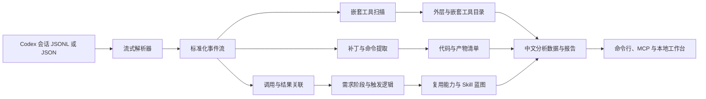

# Codex 会话全量取证方案

## 目标

将 Codex 任务编号或 JSON/JSONL 会话文件转化为可验证的中文报告。报告把外层编排调用、嵌套实际工具、调用结果、代码与文件变更、命令证据、触发逻辑和可复用工作流放在同一套证据链中。

每个可执行需求阶段都必须显示：中文标题、用户请求内容、助手回应内容、执行结果、执行阶段、关联工具和事件序号。报告的标题、表头、标签、状态和说明全部使用中文；工具名、文件路径、命令和原始会话内容作为技术证据保留原貌。

## 交付组成

| 层次 | 文件或目录 | 职责 |
|---|---|---|
| 核心解析器 | `session-forensics/lib/session-forensics.mjs` | 流式解析记录、规范化事件、关联调用结果、发现嵌套工具、提取代码与命令、组织中文展示模型。 |
| 命令行 | `session-forensics/cli.mjs` | 按任务编号或文件路径生成报告产物包。 |
| 校验器 | `session-forensics/verify.mjs` | 校验文件哈希、分析结构和中文报告章节。 |
| MCP 服务 | `mcp/codex-session-forensics-server.mjs` | 通过 stdio JSON-RPC 列出会话、检查摘要、导出报告和读取产物。 |
| 本地工作台 | `session-forensics/ui-server.mjs`、`session-forensics/ui/` | 选择会话、运行分析、按中文内容卡片查看各需求阶段、打开报告。 |
| 已安装 Skill | `E:\CodexHome\skills\codex-session-forensics\` | 供后续 Codex 对话触发的中文流程说明、PowerShell 包装脚本和报告契约。 |

## 证据流程



## 使用方式

在工作区根目录执行：

```powershell
# 按本机会话编号定位并生成报告
node session-forensics/cli.mjs --thread-id 019ffb5e-3011-7601-adae-c78fb9cad844 --include-evidence

# 直接分析导出的会话文件
node session-forensics/cli.mjs --source C:\exports\session.jsonl --out C:\analysis\session --include-evidence

# 校验已经生成的产物包
node session-forensics/verify.mjs --out output\session-forensics\019ffb5e-3011-7601-adae-c78fb9cad844

# 启动本地工作台
node session-forensics/ui-server.mjs
```

默认输出目录包含：

| 文件 | 内容 |
|---|---|
| `analysis.json` | 结构化来源、工具、代码、需求阶段、触发逻辑和 Skill 蓝图。 |
| `report.md` | 中文 Markdown 全量报告。 |
| `report.html` | 中文独立网页报告。 |
| `normalized-events.ndjson` | 保留顺序的标准化事件流。 |
| `manifest.json` | 文件大小与 SHA-256 完整性信息。 |

## 工具分层原则

会话记录中的外层调用可能只是运行时编排容器，例如任务协调、等待、代理调度或 `exec` 包装。真实工程动作往往存在于其负载内，例如命令执行、补丁应用、浏览器操作、计划更新和应用接口调用。因此报告必须同时给出：

1. 外层编排工具目录，说明调用次数、完成情况和结果关联。
2. 嵌套实际工具目录，说明从负载中恢复的具体工具与上层容器。
3. 代码与产物证据，说明文件动作、路径、来源、命令与事件序号。
4. 需求阶段内容卡片，说明“谁提出了什么、助手如何回应、随后发生了什么”。

## 触发逻辑

触发逻辑仅有两种证据级别：

- `direct`：用户请求、工具输出、状态事件或显式分支条件在记录中直接可见。
- `inferred`：由多次有序事件归纳出的模式，只描述可观察顺序。

不得将不可见推理写成事实。报告会把每条规则关联到对应的需求阶段和证据摘录。

## MCP 与界面

MCP 提供 `list_codex_sessions`、`inspect_codex_session`、`analyze_codex_session` 和 `get_session_artifact`。检查和分析结果都返回中文展示标题以及需求阶段内容；产物读取支持分页。

本地工作台默认监听 `http://127.0.0.1:8794/`。首屏展示中文报告标题、摘要和会话来源，默认“请求与执行”页逐卡显示用户请求、助手回应和执行结果；工具目录、代码证据、触发逻辑和 Skill 蓝图作为独立页签展示。

## 验收要求

1. `analysis.json` 可解析，且包含 `presentation` 与每个需求阶段的标题、请求内容、回应内容和执行结果。
2. `manifest.json` 中每个产物的大小和 SHA-256 与实际文件一致。
3. `report.md` 和 `report.html` 都存在中文标题、中文章节和需求阶段内容。
4. 页面在桌面与移动宽度下都可读取，正文不会被指标或技术编号替代。
5. MCP 的工具发现说明、命令行帮助、错误提示和 Skill 元数据均为中文。
