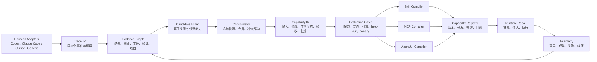

# 对话蒸馏器：竞品源码审计与可升级方案

> 审计日期：2026-08-17
> 审计对象：本地“对话蒸馏器”代码、Hivemind、xskill、Trace2Skill、Agent Workflow Memory、Codex Trace、MCP Chat Studio、mcpgen、MCP Server Generator，以及 CODESKILL 论文
> 当前结论：项目不应继续被定义为“另一个 Skill 蒸馏器”，而应升级为 **Conversation-to-Capability Compiler（对话能力编译器）**。

## 1. 结论先行

本项目已经拥有竞品组合中少见的完整纵向链路：

1. 从 Codex JSON/JSONL 中恢复会话、工具调用、结果、文件修改、命令和验证证据；
2. 识别用户纠正、失败恢复、验收结果和项目上下文；
3. 从同一份对话证据生成 Skill、独立 MCP Server、独立 Agent 和普通用户可操作的 UI；
4. 对生成包做 manifest、哈希、结构和运行入口验证。

真正的差距不在“再支持一个输出格式”，而在中间层和闭环：

- 尚无显式、版本化的 `Trace IR` 与 `Capability IR`，解析、理解和生成仍被几个大模块直接串联；
- 多会话归纳、冲突合并和能力去重仍弱于 Trace2Skill / xskill 的系统化做法；
- 包完整性验证不等于行为正确性，缺少 replay、held-out、contract、canary 四级评测；
- 缺少多 harness 输入、团队能力注册表、版本治理和运行时反馈；
- 当前 UI 暴露的是内部产物数量，而不是“30 秒内找到 5 个值得升级的能力”。

因此推荐的产品主线是：

> **历史对话 -> 可追溯证据 -> 版本化能力规范 -> 行为评测 -> Skill / MCP / Agent / UI 多目标编译 -> 注册、分发、运行反馈。**

这条主线与 Hivemind、xskill 的 Skill 终点拉开距离，也把 Codex Trace 的输入层与 MCP 生成器的输出层连接成一个完整编译系统。

---

## 2. 审计范围与方法

### 2.1 “全量代码对比”的边界

本次对公开仓库执行了两层审计：

- **全仓清点**：固定 commit、tracked files、代码文件、测试文件和代码行规模；
- **核心路径源码审计**：读取入口、解析器、蒸馏管线、存储、检索、评测、生成器、运行时和关键测试，不只依赖 README。

Trace2Skill 仓库包含大量数据和发布 Skill，因此“6,856 个 tracked files”不表示 6,856 个源代码文件。CODESKILL 截至本次审计只找到论文，未找到作者公开实现，故它只参与方法与指标对比，不被表述为“已完成源码审计”。

代码/测试文件数量采用扩展名和文件名规则统计，适合判断规模与测试密度，不作为语言级精确 LOC 工具。

### 2.2 固定快照

| 项目 | 固定提交 | tracked files | 代码文件 | 测试文件 | 代码行 | 审计身份 |
|---|---:|---:|---:|---:|---:|---|
| 本项目 `session-forensics` + MCP | 当前工作区 | - | 50 | 8 | 23,363 | 输入、蒸馏、多目标编译 |
| Hivemind | `551d366e9388a538ef68d28305b9a1b608f44878` | 721 | 599 | 309 | 143,449 | 会话采集、记忆、Skillify、团队分发 |
| xskill | `f2c6faeca03913f0f0ee783bc711b5ff0306aef1` | 618 | 373 | 217 | 134,712 | 多 harness Skill 蒸馏、SkillHub、评测 |
| Trace2Skill | `3d0b52a140f002a512930252b613c49048f7d5ac` | 6,856 | 38 | 0 | 15,951 | 轨迹局部经验提取与层级合并 |
| Agent Workflow Memory | `8c0ff8cd11d648c8fceb99e4e42f37e3b75381b1` | 55 | 29 | 0 | 4,457 | 历史轨迹中的 workflow 归纳与复用 |
| Codex Trace | `c0bd7bb8cb99d379056fd7f0e1ed5fd6bfcbc3cf` | 144 | 86 | 16 | 20,880 | Codex JSONL 发现、解析、搜索与查看 |
| MCP Chat Studio | `59a352437374aba2cbb95e5f3dbe2d3b2f5c1a84` | 152 | 89 | 17 | 48,414 | MCP 录制、回放、断言、契约与漂移检测 |
| mcpgen | `36324c43a471b6b5aa0671d963c7f1fc22c839be` | 65 | 52 | 21 | 8,939 | OpenAPI -> Go MCP Server |
| MCP Server Generator | `0c3ca7db1d1296450ec15cb41369cdb4bd93e2fa` | 168 | 92 | 0 | 12,289 | 数据源 schema -> SQL 工具与 MCP runtime |
| CODESKILL | arXiv `2605.25430` | 未发现公开代码 | - | - | - | 可学习的 Skill 管理策略与持续 Skill Bank |

### 2.3 本项目当前验证基线

本次重新执行：

```text
npm run test:session-forensics
tests: 25
pass: 25
fail: 0
duration: 19.9s
```

覆盖面包括多会话、项目证据、Skill/MCP/Agent 包、标准 MCP handshake、文件写入、检查点、失败恢复、Agent 工具轨迹、命令与验证证据、敏感信息保护等。

---

## 3. 对用户原始竞品判断的校正

### 3.1 Hivemind：比“只生成 Skill”更宽，但 Skillify 仍是能力沉淀终点

原判断基本正确，但需要补充：Hivemind 不只采集会话并写 `SKILL.md`，它还具备 DeepLake 存储、语义召回、主动上下文注入、团队 scope、promotion、telemetry 和 Skill 改进链路。

源码显示：

- `skillify-worker.ts` 要求至少 3 个 exchange，并做 `KEEP / SKIP / MERGE` 决策；
- Skill 必须包含 trigger，支持 watermark 和团队 promotion；
- 但进入 Skillify 的文本会去掉 tool calls，意味着“原始采集保留工具信息”与“能力抽取使用工具因果证据”不是一回事；
- Recall 主要是语义检索、阈值过滤与 deadline 控制，尚不是一个把历史轨迹编译为可执行 MCP/Agent 的中间表示系统。

**对本项目的含义**：不要复制它的 Skill 终点；应借鉴它的运行时 recall、scope、promotion 和 telemetry。

### 3.2 xskill：产品化最接近，但 Codex 深解析反而是本项目机会

xskill 的强项不是单点蒸馏算法，而是完整 Skill 运营系统：多生态 adapter、pipeline、SkillHub、推荐、团队共享、评分、dashboard、durable restart、cross-trace atoms 和 canary。

但固定快照中的 Codex adapter 对 `response_item` 仍主要做计数和占位，没有深入恢复 tool call / function output 因果链。源码注释也把这部分放到后续阶段。

**对本项目的含义**：

- xskill 是 Skill 层的直接竞品；
- 本项目的差异化应放在“证据级 Codex 解析 + 纠错语义 + 多目标编译”；
- 应借鉴它的有界并发、可恢复 pipeline、sticky canary、cohort 和团队运营，而不是把产品缩成 SkillHub。

### 3.3 Trace2Skill：可借鉴的是冻结快照的 Map/Reduce，而不是表面上的 Skill 文件

Trace2Skill 的关键方法是：

1. 从每条 trajectory 提取局部 patch；
2. MAP 阶段基于冻结的共享 Skill 快照并行工作，避免并发写导致漂移；
3. REDUCE 阶段合并、去重、解决冲突；
4. APPLY 后执行结构和行为验证；
5. 用多随机种子与 held-out tasks 防止“看起来合理但不可泛化”。

**对本项目的含义**：把当前逐会话生成升级为 `candidate atom -> frozen snapshot -> reduce -> validate -> publish`，这是 V6 最值得落地的方法。

### 3.4 CODESKILL：证明方向，但现阶段不应直接上强化学习

CODESKILL 论文提出可学习的 Skill 管理策略、多粒度 procedural skill bank，以及 rubric dense reward + downstream verifiable sparse reward 的混合奖励。论文摘要报告其在 EnvBench、SWE-Bench Verified、Terminal-Bench 2 上，相对 no-skill 平均提升 9.69 个 pass-rate 点，相对最强 prompt/memory baseline 提升 4.01 点，并保持 Skill Bank 规模稳定。

这些是论文报告指标，不是本项目复现实验结果。当前项目缺少稳定的行为 evaluator、held-out corpus 和足够的线上反馈，直接引入 RL 会把不可靠评测放大为不可靠策略。

**正确顺序**：先建 Capability IR 与可验证 reward，再积累数据，最后考虑 learnable manager。

### 3.5 Agent Workflow Memory：理论祖先，不是工程形态上的直接竞品

AWM 证明了从带标注历史轨迹归纳常见子流程、再注入后续任务的价值，并同时讨论 offline 与 online induction。其代码围绕研究任务与特定数据集，不提供 coding harness 深解析、MCP 生成或普通用户 UI。

**对本项目的含义**：把“历史过程”视为可复用 workflow，而不是聊天摘要；具体工程架构仍需本项目完成。

### 3.6 Codex Trace：输入兼容性标杆，不是蒸馏竞品

Codex Trace 已覆盖本地 JSONL 发现、搜索、live tail、token、工具调用、协作链、SSE、多格式、压缩与归档场景，并有 parser tests 验证 zstd、archive、history/forks 和 ongoing sessions。

**对本项目的含义**：

- 可把它当成输入兼容性测试清单；
- 本项目更强的是语义证据与能力编译；
- 后续不应重复造 viewer，而应建立 adapter conformance corpus，确保新 Codex 格式不会静默丢事件。

### 3.7 MCP Chat Studio / mcpgen / MCP Server Generator：输出层三种不同参照物

- **MCP Chat Studio**：强在录制/回放、14 类断言、consumer contract、版本快照和 schema drift；最值得借鉴的是行为验证台。
- **mcpgen**：强在确定性的 OpenAPI 3 -> Go MCP 代码生成、JSON Schema、客户端类型与保留手写 handler；它假设 Tool 已知。
- **MCP Server Generator**：强在从数据源 schema 和自然语言生成 SQL 工具，并提供 `tools/list` / `tools/call` runtime；它的发现对象是数据库 schema，不是历史成功轨迹。

**本项目的核心差异**：不是“已知 schema 后生成 MCP”，而是先从历史执行证据中发现并规范化 Tool，再编译 MCP。

---

## 4. 能力矩阵

图例：`强` = 核心能力且有源码/测试证据；`有` = 已实现但不是最强项；`局部` = 只覆盖部分链路；`无` = 固定快照未见。

| 能力 | 本项目 | Hivemind | xskill | Trace2Skill | AWM | Codex Trace | MCP 输出组 |
|---|---|---|---|---|---|---|---|
| Codex tool call/result 深度配对 | **强** | 有 | 局部 | 局部 | 局部 | 强 | 无 |
| 外层编排与内层真实工具区分 | **强** | 局部 | 局部 | 无 | 无 | 有 | 无 |
| 命令、patch、文件、验证证据 | **强** | 有 | 局部 | 有 | 局部 | 展示为主 | 无 |
| 用户纠正与失败恢复语义 | **强** | 局部 | 有 | 有 | 局部 | 无 | 局部 |
| 项目代码/Git 上下文融合 | **强** | 局部 | 有 | 局部 | 无 | 无 | schema/API |
| 多轨迹归纳与冲突合并 | 局部 | 有 | **强** | **强** | 有 | 无 | 无 |
| Skill 编译 | 强 | 强 | **强** | 强 | workflow | 无 | 无 |
| MCP 编译 | **强** | 无 | 无 | 无 | 无 | 无 | **强** |
| 独立 Agent/UI 编译 | **强** | 无 | 无 | 无 | 无 | viewer | Studio UI |
| 运行时语义召回与注入 | 无 | **强** | 有 | 无 | 有 | 搜索 | 无 |
| Replay / held-out 行为评测 | 局部 | 局部 | 强 | **强** | 研究评测 | parser tests | **强** |
| Canary / cohort / promotion | 无 | promotion | **强** | 无 | 无 | 无 | versioning |
| 团队注册、版本、分发 | 局部 | 强 | **强** | bank | 无 | 无 | 局部 |
| 输入格式兼容与 live viewer | 有 | 有 | 有 | 无 | 无 | **强** | 无 |
| 能力级 provenance | **强** | 局部 | 有 | 有 | 局部 | 原始轨迹 | schema provenance |

### 4.1 竞争定位

```text
Codex Trace         = 输入查看器
Hivemind            = 会话记忆 + Skillify + 运行时召回
xskill              = 多 harness Skill 平台
Trace2Skill/AWM     = 轨迹归纳方法
MCP 生成器          = 已知 Tool/schema -> MCP

本项目目标          = 历史会话证据 -> Capability IR -> Skill/MCP/Agent/UI
```

“对话能力编译器”是唯一能同时解释现有代码资产和下一步商业差异的定位。

---

## 5. 本项目源码现状

### 5.1 已形成的护城河

#### A. 证据级 Codex 解析

`session-forensics/lib/session-forensics.mjs` 已经完成：

- 通过 `call_id` 建立调用与输出关联（约 120-145 行）；
- 从 wrapper code 恢复嵌套工具，而不是把外层 orchestrator 当作最终动作（约 256-259 行）；
- 成对恢复 call/result（约 476-507 行）；
- 提取命令、patch 和工具事件（约 611-649 行）；
- 区分直接证据与推断证据（约 832、952-973 行）；
- 输出 `analysis.json`、`report.md`、`report.html`、`normalized-events.ndjson`、`manifest.json`（约 1378-1382 行）。

这是相对 xskill 固定快照中 Codex `response_item` 浅解析的明确优势。

#### B. 一份证据，多目标交付

`conversation-packager.mjs` 与 `root-capability-packager.mjs` 支持：

- Skill；
- 独立 MCP；
- 独立 Agent + UI；
- manifest、完整性信息、归档和 package verify；
- Agent 工具、命令、文件修改、验证、检查点和恢复语义。

这已经超出“生成 `SKILL.md`”的能力边界。

#### C. 纠正、验收和项目证据

项目存在多会话、项目发现、项目证据、语义蒸馏、推荐和 evidence graph 模块。测试确认了 correction precedence、acceptance、recovery 和 secret-safe runtime 等关键行为。

#### D. 确定性 fallback

`conversation-ai-distiller.mjs` 在模型不可用时保留确定性蒸馏路径，并把模型结果与本地结果合并。这是离线可用和可复现的重要基础。

### 5.2 当前架构债务

#### A. 中间表示隐含在对象结构中

现在从 parser 到 packager 依赖内部对象约定，没有独立 schema/version/migration。后果是：

- 新输入 adapter 必须理解下游私有结构；
- Skill、MCP、Agent 容易各自重新解释语义；
- 字段变化可能只在生成后才暴露；
- 无法稳定缓存、比较和升级已经发布的能力。

#### B. Packager 过大

- `conversation-packager.mjs`：约 1,989 行；
- `root-capability-packager.mjs`：约 2,237 行；
- `session-forensics.mjs`：约 1,412 行。

它们同时承担规范化、模板组装、文件写入、manifest 和验证职责。新增 target 会继续复制逻辑。

#### C. “包验证”与“能力验证”混淆

当前 verify 能回答：

- 文件是否存在；
- 哈希是否匹配；
- manifest 是否完整；
- runtime 能否启动；
- MCP handshake 是否可用。

但它不能充分回答：

- 新能力在未见过的相似任务上是否成功；
- 是否遗漏前置条件；
- 参数 schema 是否从偶然样本中过拟合；
- 用户纠正是否在生成物中真正压过早期错误步骤；
- 新版本是否比旧版本更好。

#### D. 多会话能力归纳尚未成为一级流水线

已经有 multi-source/project evidence，但尚无稳定的 atom、candidate、merge conflict、frozen snapshot、held-out publish gate 等一等概念。

#### E. 输入和运营层不完整

- 输入主力仍是 Codex，缺少 Claude Code、Cursor 和 generic adapter 的一致契约；
- 无能力 registry、版本图、安装 ledger、团队 policy；
- 无运行时 recall、use telemetry、成功/失败反馈；
- UI 研究已发现 931 条会话只能搜索到 300 条、卡片重复、产物过多等问题。

---

## 6. 目标架构：对话能力编译器



核心原则：

1. **Evidence first**：任何生成步骤都能回指原会话事件或项目证据；
2. **IR first**：编译目标只消费 Capability IR，不直接读取某个 harness 的私有事件；
3. **Evaluation before publish**：完整性通过只是 build 成功，行为 gate 通过才允许 publish；
4. **Immutable provenance**：已发布版本保留 fingerprint、source sessions 和 evaluator 结果；
5. **Compiler parity**：Skill/MCP/Agent 表达相同能力语义，差异只在 target adapter；
6. **Progressive automation**：低置信度候选先让人确认，高置信度且 held-out 通过后自动推广。

---

## 7. 两级中间表示

### 7.1 Trace IR：屏蔽输入格式差异

建议新增 `trace-ir/v1`，最小模型如下：

```ts
type TraceEvent = {
  schemaVersion: "trace-ir/v1";
  eventId: string;
  sessionId: string;
  parentEventId?: string;
  timestamp?: string;
  actor: "user" | "assistant" | "tool" | "system" | "subagent";
  kind:
    | "message"
    | "tool_call"
    | "tool_result"
    | "command"
    | "patch"
    | "artifact"
    | "verification"
    | "correction"
    | "checkpoint";
  harness: { name: string; version?: string; rawType?: string };
  payload: unknown;
  links: {
    callId?: string;
    resultFor?: string;
    replaces?: string;
    verifies?: string[];
    produced?: string[];
  };
  provenance: {
    sourcePath: string;
    byteOffset?: number;
    line?: number;
    rawHash: string;
  };
  confidence: number;
};
```

Trace IR 负责表达“发生了什么”，不负责表达“应该复用成什么能力”。

必须保留：

- 原始事件 hash；
- tool call/result 配对状态；
- outer/nested tool 标记；
- direct/inferred 标记；
- correction replacement 边；
- 文件、命令、验证和项目 evidence ref；
- 脱敏前后引用关系，但不把 secret 写入 IR。

### 7.2 Capability IR：所有输出目标的唯一语义源

建议新增 `capability-ir/v1`：

```ts
type CapabilitySpec = {
  schemaVersion: "capability-ir/v1";
  id: string;
  version: string;
  fingerprint: string;
  title: string;
  summary: string;
  triggers: TriggerSpec[];
  preconditions: ConditionSpec[];
  inputSchema: JsonSchema;
  steps: Array<{
    id: string;
    instruction: string;
    toolContract?: ToolContract;
    evidenceRefs: string[];
    confidence: number;
    onFailure?: RecoveryRef;
  }>;
  outputSchema: JsonSchema;
  acceptance: AssertionSpec[];
  recovery: RecoverySpec[];
  security: {
    secretPolicy: string;
    filesystemScopes?: string[];
    networkScopes?: string[];
  };
  provenance: {
    sourceSessions: string[];
    projectFingerprints: string[];
    evidenceGraphHash: string;
  };
  evaluation: {
    static?: EvaluationResult;
    contract?: EvaluationResult;
    replay?: EvaluationResult;
    heldout?: EvaluationResult;
    canary?: EvaluationResult;
  };
};
```

Capability IR 负责表达“可复用能力的规范”。它必须覆盖：

- 何时触发；
- 前置条件和参数；
- 过程步骤与工具契约；
- 产出和验收；
- 失败恢复与回滚；
- 安全/权限约束；
- 每一步的证据来源和置信度；
- 行为评测结果。

### 7.3 为什么必须拆成两级

只有一个大 JSON 会重新制造当前耦合：原始会话的高频格式变化会污染能力版本；能力编辑又会反向破坏原始证据。

两级 IR 允许：

- adapter 只对 Trace IR 负责；
- miner/evidence graph 负责从事实到候选能力；
- compiler 只对 Capability IR 负责；
- 同一能力可以换输入来源或换输出 target；
- 旧能力可以在不重新读取原 JSONL 的情况下升级编译器；
- 所有版本变更可做 schema migration 和语义 diff。

---

## 8. 建议模块拆分

```text
session-forensics/lib/
  ir/
    trace-ir.mjs
    capability-ir.mjs
    migrations.mjs
    schemas/
      trace-ir.v1.schema.json
      capability-ir.v1.schema.json
  adapters/
    codex.mjs
    claude-code.mjs
    cursor.mjs
    generic-jsonl.mjs
    conformance.mjs
  evidence/
    pair-calls.mjs
    extract-artifacts.mjs
    extract-corrections.mjs
    extract-verifications.mjs
    build-evidence-graph.mjs
  mining/
    candidate-miner.mjs
    atomizer.mjs
    frozen-snapshot.mjs
    map-reduce-consolidator.mjs
    conflict-resolver.mjs
    fingerprint.mjs
  evaluation/
    static-validator.mjs
    contract-runner.mjs
    trace-replay.mjs
    heldout-evaluator.mjs
    canary.mjs
  compilers/
    skill-compiler.mjs
    mcp-compiler.mjs
    agent-ui-compiler.mjs
    shared-runtime.mjs
  registry/
    capability-store.mjs
    version-store.mjs
    install-ledger.mjs
    promotion-policy.mjs
  runtime/
    retriever.mjs
    recommendation-ranker.mjs
    telemetry.mjs
```

迁移期间保留原入口作为 facade：

- `session-forensics.mjs` -> 调用 `adapters/codex` + evidence pipeline；
- `conversation-packager.mjs` -> 调用 Capability IR builder + target compiler；
- `root-capability-packager.mjs` -> 调用 registry + compilers；
- MCP server 现有工具名保持兼容，新增 `irVersion`、`capabilityId` 和 evaluation artifact。

不要一次性重写三个大文件。先建立 golden tests 和双写，再逐段抽取。

---

## 9. 评测与发布门禁

### 9.1 五级 gate

| Gate | 要回答的问题 | 典型检查 | 发布影响 |
|---|---|---|---|
| G0 Parse | 原始轨迹是否完整进入 Trace IR？ | event coverage、call/result pairing、unknown event ledger | 不通过则禁止蒸馏 |
| G1 Static | Capability IR 是否结构完整且证据可追溯？ | JSON Schema、evidence refs、secret scan、fingerprint | 不通过则禁止编译 |
| G2 Contract | 编译物是否满足目标协议？ | MCP initialize/list/call、input/output schema、Agent tool contract | 不通过则 build fail |
| G3 Replay | 能否复现原成功轨迹并正确处理原失败？ | recorded tool stubs、assertions、correction precedence | 不通过则不可发布 |
| G4 Held-out | 能否迁移到未参与蒸馏的相似任务？ | task family split、pass rate、regression、multi-seed | 不通过则保留 draft |
| G5 Canary | 新版本在线是否优于旧版本？ | sticky cohort、success/abort/correction、latency/cost | 不优则回滚 |

### 9.2 借鉴关系

- 从 MCP Chat Studio 借鉴 record/replay、assertions、consumer contract 和 schema drift；
- 从 Trace2Skill 借鉴 frozen snapshot、MAP/REDUCE、held-out 和 multi-seed；
- 从 xskill 借鉴 sticky canary、cohort、promotion/reject；
- 从 Hivemind 借鉴 use telemetry 与团队 promotion；
- 本项目继续保留 evidence ref、correction precedence 和 target package integrity。

### 9.3 行为评测不能直接执行生产副作用

Replay 默认使用：

- recorded response stub；
- 临时目录；
- fake network / tool adapter；
- 明确 allowlist；
- deterministic clock；
- secret placeholders。

只有标记为 integration 的 held-out case 才进入隔离环境执行真实工具。评测产物必须记录环境 fingerprint，否则跨机器结果不可比较。

---

## 10. 多会话蒸馏算法升级

建议把“会话 -> 包”改成以下稳定流水线：

1. **Normalize**：每个 harness 转为 Trace IR；
2. **Graph**：配对 call/result，连接文件、patch、验证、纠正和项目证据；
3. **Segment**：按目标、阶段、失败恢复和验收切分 task chain；
4. **Atomize**：提取可独立复用的局部步骤，不直接生成最终 Skill；
5. **Candidate**：按 trigger、输入 schema、工具序列、产出和 evidence fingerprint 聚类；
6. **Map**：每条轨迹基于同一冻结 capability snapshot 提交 patch；
7. **Reduce**：去重、合并同义步骤、保留条件分支、解决 correction 冲突；
8. **Specify**：生成 Capability IR；
9. **Evaluate**：依次跑 static、contract、replay、held-out；
10. **Compile**：生成 Skill/MCP/Agent/UI；
11. **Publish**：写 registry、版本关系、安装 ledger；
12. **Observe**：运行时记录被推荐、被采用、成功、失败和再次纠正。

### 10.1 冲突优先级

同一候选能力存在矛盾证据时，建议排序：

```text
用户明确纠正
> 后续通过验证的步骤
> 后续成功结果
> 项目当前源码/Git 证据
> 早期未验证步骤
> 模型推断
```

任何自动合并都应保留被淘汰分支及理由，避免“最新一句话覆盖所有历史”的不可审计行为。

### 10.2 去重 fingerprint

不要按标题或自然语言摘要去重。建议 fingerprint 由以下规范化字段构成：

- trigger intent family；
- normalized input schema；
- tool contract sequence / dependency DAG；
- output schema；
- acceptance assertions；
- project scope；
- security scope。

文本描述可编辑，但结构 fingerprint 稳定。这样可解决 UI 中同一能力产生 Skill/MCP/Agent 三张近似卡片的问题：卡片展示 capability，target 变成同一卡片中的构建选项。

---

## 11. UX 升级：从“产物浏览器”到“能力收件箱”

现有 UX 研究已经发现：

- 本地约 931 条会话，搜索路径只覆盖约 300 条；
- 同一能力的多个 target 形成重复卡片；
- 24 个 package 卡片增加选择成本；
- 用户真正需要的是短路径：最近成功对话 -> 候选能力 -> 证据 -> 一键生成/打开。

建议首屏改为 **Capability Inbox**：

```text
[待确认 3] [可升级 2] [已发布 18] [需修复 1]

候选能力：从完整对话生成专业报告
来源：7 个成功会话 / 2 个项目 / 最近验证 2 天前
置信度：高    泛化评测：8/10    纠正已吸收：3

[查看证据] [编辑规范] [生成 MCP] [打开 Agent]
```

交互原则：

1. 一张卡片对应一个 capability，不对应一个 package target；
2. 默认最多展示 5 个推荐，目标 30 秒内完成判断；
3. 证据抽屉直接显示“该步骤来自哪次工具调用/验证/纠正”；
4. Skill/MCP/Agent/UI 用 segmented control 选择，不重复占据信息流；
5. 低置信度字段在规范编辑器内高亮；
6. 发布前只显示 gate 结果和可操作失败原因；
7. 已发布能力显示使用次数、成功率、最近回归和可回滚版本。

---

## 12. 分阶段升级路线

### V5：编译器地基（P0，2-3 周）

**目标**：在不破坏现有 CLI/MCP/UI 的前提下建立版本化 IR。

交付：

- `trace-ir/v1`、`capability-ir/v1` JSON Schema；
- Codex adapter 把现有 parser 结果双写为 Trace IR；
- Capability IR builder；
- provenance、confidence、fingerprint、dedupe；
- 三个 compiler facade，保持现有输出字节尽可能一致；
- golden corpus：正常、嵌套工具、缺失 result、压缩/归档、协作、纠正、失败恢复；
- schema migration 和 unknown-event ledger。

完成标准：

- 现有 25 项测试全部继续通过；
- golden corpus event coverage >= 99%；
- 可配对事件 call/result pairing >= 98%；
- 所有生成步骤 provenance coverage = 100%；
- 同一 source + config 的 IR fingerprint 可复现；
- 旧 CLI、MCP tool name 和 UI 入口无破坏性变化。

### V6：多会话归纳与行为评测（P1，3-5 周）

**目标**：从“能生成”升级为“经验证可复用”。

交付：

- atomizer、candidate miner、frozen snapshot、map/reduce consolidator；
- correction/conflict policy；
- MCP/Agent consumer contract；
- trace replay runner 与 assertion DSL；
- held-out task family split；
- draft / validated / published 状态机；
- capability semantic diff。

完成标准：

- correction precedence 测试 100% 通过；
- package target contract tests 100% 通过；
- held-out 相对无能力基线成功率提升目标 >= 10%；
- 已通过旧版本用例的回归率 <= 2%；
- 多次运行的候选集合和 fingerprint 稳定；
- 没有 held-out 证据的候选不能自动 publish。

### V7：多 harness 与团队注册表（P1，4-6 周）

**目标**：从 Codex 专用工具升级为组织级能力资产系统。

交付：

- Claude Code、Cursor、generic JSONL adapter；
- adapter conformance suite；
- capability registry、version graph、install ledger；
- workspace/team scope、promotion policy、redaction policy；
- 导入/导出与 target compatibility matrix；
- Capability Inbox 首版。

完成标准：

- 每个 adapter 使用同一套 Trace IR conformance tests；
- 能力版本可 install、upgrade、rollback；
- 团队包不包含原始 secret 或本机绝对敏感路径；
- 900+ 会话的推荐 Precision@5 目标 >= 0.8；
- 首次找到并打开有用能力的中位时间 < 30 秒。

### V8：运行时召回与渐进发布（P2，4-6 周）

**目标**：让能力真正影响下一次任务，并形成质量闭环。

交付：

- semantic + lexical hybrid retriever；
- recommendation context injection；
- sticky canary/cohort；
- adoption/success/failure/correction telemetry；
- promotion/reject/rollback automation；
- 已发布能力的自动重编译和 schema drift 检查。

完成标准：

- recall latency 和 token budget 有明确上限；
- canary 按 capability version 粘性分流；
- 新版本未优于主版本时自动 reject；
- 一键回滚恢复 compiler artifact、registry pointer 和 runtime routing；
- telemetry 默认最小化、可关闭且不保存认证材料。

### V9：可学习的能力管理器（P3，6-10 周，数据成熟后）

**前置条件**：至少拥有稳定 held-out evaluator、足够多真实采用事件、明确 reward 和可回滚策略。

再考虑：

- 学习何时创建、合并、拆分、检索或弃用 capability；
- dense rubric reward + sparse verifiable outcome；
- 控制 Skill Bank 规模与检索噪声；
- 离线策略评估后再小流量 canary。

这一步借鉴 CODESKILL 的研究方向，但不能替代 V5-V8 的工程地基。

---

## 13. 优先级 Backlog

| ID | 优先级 | 任务 | 依赖 | 可验证结果 |
|---|---|---|---|---|
| CC-001 | P0 | 定义 Trace IR v1 schema | 无 | golden events 全部 schema-valid |
| CC-002 | P0 | 定义 Capability IR v1 schema | CC-001 | 三 target 只消费 Capability IR |
| CC-003 | P0 | Codex adapter 双写 | CC-001 | 旧 report 与新 IR evidence 数一致 |
| CC-004 | P0 | 建立 raw event/IR golden corpus | CC-001 | 新格式变化触发失败而非静默丢失 |
| CC-005 | P0 | 抽取 shared compiler runtime | CC-002 | packager 重复逻辑下降，现有测试通过 |
| CC-006 | P0 | 结构 fingerprint 与 capability 去重 | CC-002 | 多 target 合并为一个 capability |
| CC-007 | P1 | correction/conflict resolver | CC-001/2 | 纠正优先级测试 100% |
| CC-008 | P1 | atomizer + candidate miner | CC-001/7 | 单/多会话产生稳定 atoms |
| CC-009 | P1 | frozen MAP/REDUCE consolidator | CC-008 | 并行与串行结果语义一致 |
| CC-010 | P1 | MCP/Agent contract runner | CC-002/5 | initialize/list/call/schema 全覆盖 |
| CC-011 | P1 | replay assertion DSL | CC-010 | 原成功、原失败、恢复均可回放 |
| CC-012 | P1 | held-out evaluator | CC-008/11 | 报告 baseline/uplift/regression |
| CC-013 | P1 | registry/version/install ledger | CC-002/6 | install/upgrade/rollback 可审计 |
| CC-014 | P1 | Capability Inbox | CC-006/13 | 5 个推荐、一个能力一张卡 |
| CC-015 | P1 | Claude/Cursor adapters | CC-001/4 | 通过统一 conformance suite |
| CC-016 | P2 | hybrid runtime retrieval | CC-013 | latency/token/precision 达标 |
| CC-017 | P2 | canary + promotion policy | CC-012/13/16 | sticky cohort 与自动回滚 |
| CC-018 | P2 | telemetry feedback graph | CC-013/16 | outcome 回写 Evidence Graph |
| CC-019 | P3 | learnable manager 实验 | CC-012/17/18 | 离线优于规则基线后才 canary |

---

## 14. 指标体系

### 14.1 解析质量

- Event coverage：>= 99%；
- Known call/result pairing：>= 98%；
- Unknown event：100% 进入 ledger，不静默丢弃；
- Artifact/command/patch direct evidence precision：人工抽样 >= 95%；
- Correction precedence：测试集 100%。

### 14.2 能力规范质量

- Generated step provenance coverage：100%；
- Required input schema 人工接受率：>= 90%；
- Capability duplicate collapse：同结构、多 target 重复卡片归零；
- Low-confidence field exposure：100%；
- Secret scan：发布包严重泄露事件为 0。

### 14.3 行为质量

- Contract pass：发布版本 100%；
- Held-out uplift：相对 no-capability baseline 目标 >= 10%；
- Regression：<= 2%；
- Recovery path pass：>= 95%；
- 多随机种子结果需报告均值与波动，禁止只报最好一次。

### 14.4 产品质量

- Recommendation Precision@5：>= 0.8；
- 931+ 会话全量可发现，不再固定截断为 300；
- Time to useful capability：< 30 秒；
- 从确认候选到生成可运行 Agent：< 3 分钟；
- 打开生成 Agent/UI：1 次明确操作；
- capability adoption、success、correction、rollback 均可审计。

所有数字均为建议验收目标，不是当前已达成指标。

---

## 15. 技术决策与风险

### 15.1 应立即做

1. 建立双 IR 和 schema version；
2. 建 golden corpus，锁住当前 Codex 深解析优势；
3. 把三个输出目标改为消费同一 Capability IR；
4. 引入行为 gate，区分 build success 与 capability success；
5. 用 capability fingerprint 统一 UI 卡片与版本身份。

### 15.2 暂时不要做

1. 不要先建一个大型 SkillHub，再寻找差异化；
2. 不要继续在两个 2,000 行 packager 中平行添加 target；
3. 不要用 LLM 评分代替 replay/held-out 的可验证结果；
4. 不要在没有 evaluator 和 telemetry 前直接做 RL；
5. 不要把 Codex Trace viewer 整体重做一遍，优先补 adapter conformance；
6. 不要从竞品直接复制代码，先逐仓核验 license 和依赖兼容性，只借鉴架构契约与方法。

### 15.3 主要风险与控制

| 风险 | 表现 | 控制 |
|---|---|---|
| IR 过度设计 | 两个月都在改 schema | v1 只承载当前测试已有事实，双写迭代 |
| 蒸馏过拟合 | replay 成功、held-out 失败 | task-family split、多 seed、发布 gate |
| 多会话错误合并 | 相似标题掩盖不同前置条件 | 结构 fingerprint、冲突分支、人工确认 |
| 生成物语义漂移 | Skill/MCP/Agent 行为不一致 | compiler parity tests、Capability IR 单一真源 |
| 线上召回污染上下文 | 错 Skill 被主动注入 | hybrid retrieval、阈值、budget、canary、关闭开关 |
| 隐私泄露 | 会话 secret 进入团队包 | raw/IR 分层、redaction、secret scan、最小 telemetry |
| 兼容性回归 | Codex JSONL 格式变化 | unknown ledger、golden corpus、Codex Trace 场景清单 |

---

## 16. 最终产品定义

建议统一对外描述：

> **对话蒸馏器是一个对话能力编译器。它从 coding agent 的真实成功轨迹中恢复工具、修改、验证和纠正证据，将其归纳为可追溯、可评测、可版本化的 Capability，并编译成 Skill、MCP Server、独立 Agent 或可点击 UI。**

一句话差异：

> Hivemind/xskill 主要把轨迹沉淀为 Skill；Codex Trace 主要把轨迹变得可读；MCP 生成器主要把已知 schema 变成 Tool；本项目把“过去做成过的事”编译为经过验证、可分发、可运行的多形态能力。

下一版本的成功标志不是多生成一个文件，而是：

1. 用户能在 30 秒内从历史会话找到一个高价值能力；
2. 每个能力步骤都能回到原证据；
3. 它在 held-out 任务上确实提高成功率；
4. 同一 Capability 能一致地编译为 Skill/MCP/Agent/UI；
5. 新版本能 canary、比较、推广和回滚。

---

## 17. 源码证据索引

### 17.1 本项目

- `session-forensics/lib/session-forensics.mjs`：Codex 解析、call/result 配对、命令/patch、证据标签、分析产物；
- `session-forensics/lib/conversation-packager.mjs`：Skill/MCP/Agent target、package create/verify；
- `session-forensics/lib/root-capability-packager.mjs`：根能力包、MCP/Agent runtime、archive verify；
- `session-forensics/lib/conversation-ai-distiller.mjs`：确定性 fallback 与模型合并；
- `session-forensics/lib/session-semantic-index.mjs`：task chain 与语义索引；
- `session-forensics/lib/distillation-recommendation.mjs`：评分与 evidence graph；
- `mcp/codex-session-forensics-server.mjs`：MCP 工具入口；
- `docs/USER_EXPERIENCE_RESEARCH_2026-08-17.md`：本地会话发现与 UI 问题基线。

### 17.2 外部一手来源

1. [Hivemind 仓库](https://github.com/activeloopai/hivemind)；[Skillify worker 固定提交](https://github.com/activeloopai/hivemind/blob/551d366e9388a538ef68d28305b9a1b608f44878/src/skillify/skillify-worker.ts)；[Recall hook](https://github.com/activeloopai/hivemind/blob/551d366e9388a538ef68d28305b9a1b608f44878/src/hooks/recall.ts)
2. [xskill 仓库](https://github.com/SkillNerds/xskill)；[Codex adapter 固定提交](https://github.com/SkillNerds/xskill/blob/f2c6faeca03913f0f0ee783bc711b5ff0306aef1/src/xskill/ecosystems/codex.py)；[xskill 文档](https://xskill.wiki/)
3. [Trace2Skill 仓库](https://github.com/Qwen-Applications/Trace2Skill)；[Trace2Skill 论文](https://arxiv.org/abs/2603.25158)
4. [CODESKILL 论文](https://arxiv.org/abs/2605.25430)
5. [Agent Workflow Memory 仓库](https://github.com/zorazrw/agent-workflow-memory)；[AWM 论文](https://arxiv.org/abs/2409.07429)
6. [Codex Trace 仓库](https://github.com/PixelPaw-Labs/codex-trace)
7. [MCP Chat Studio 仓库](https://github.com/JoeCastrom/mcp-chat-studio)
8. [mcpgen 仓库](https://github.com/lyeslabs/mcpgen)
9. [MCP Server Generator 仓库](https://github.com/mnfst/mcp-server-generator)

### 17.3 证据解释规则

- 仓库链接用于源码和测试事实；
- arXiv 链接用于研究方法与论文报告指标；
- 本地测试结果只证明本项目当前工作区的回归状态；
- 路线图中的百分比、耗时和质量阈值是建议目标，不被描述为当前成就；
- 外部仓库未来可能变化，因此所有源码判断以第 2.2 节固定 commit 为准。
