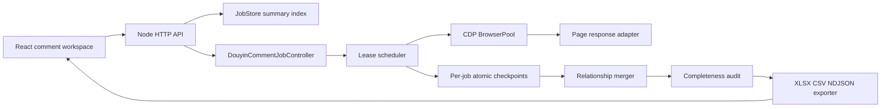

# MKT Master Douyin Profile Comments: Technical Design

## 1. Decision and Scope

This document specifies a first-class MKT Master feature named **Douyin Profile
Comments**. It incorporates the two supplied conversation outcomes:

- `019ffb5e-3011-7601-adae-c78fb9cad844`: catalog public profile works, collect
  root comments and reply trees, preserve comment-to-video and comment-to-comment
  relationships, then export an auditable XLSX archive.
- `019f9da3-84f5-7bf3-b26b-2b4f10f7a9ff`: durable local state, append-safe
  recovery, restart handling, and evidence-based completion rather than optimistic
  status changes.

The feature collects public comment data associated with public works listed on a
Douyin profile. It does not download, proxy, cache, analyze, or export video,
audio, playlist, or cover media.

"Full" has a bounded, testable meaning: all works in the profile snapshot have
their root-comment cursor chain exhausted, and every discovered root comment with
replies has its reply cursor chain exhausted. A job is only `complete` when this
technical condition and the platform's displayed counts agree. If all available
public cursors have been exhausted but counts differ, the terminal state is
`public_api_complete_with_gap`.

## 2. Current Baseline and Required Refactor

The existing implementation is valuable but is a one-off CLI, not a multi-job
product service:

| Existing component | Current capability | Required change |
| --- | --- | --- |
| `server/scripts/collect-douyin-comments-cdp.mjs` | CDP collection, simple concurrency, video JSON output | Extract reusable collector modules; remove fixed account, output path, video id, and page assumptions. |
| `server/scripts/merge-douyin-api-checkpoints.mjs` | Offline relationship merge | Call it from the job finalizer; make a per-job validation result mandatory. |
| `server/scripts/build-douyin-comment-archive.mjs` | XLSX/CSV/NDJSON archive | Call it only against a stable merge snapshot; publish artifact metadata. |
| `server/store.mjs` | Compact job summaries and restart interruption marker | Keep it as the portal index only; do not put raw comment pages or per-thread state into `jobs.json`. |
| `server/index.mjs` | HTTP routes and generic job scheduling | Add a dedicated job controller, event stream, auto-recovery and artifact routes. |

The present collector has five blockers for a productized version:

1. One CDP client/target evaluates multiple videos concurrently in one page.
   There is no tab ownership, lease, heartbeat, or tab recovery boundary.
2. It derives future cursors from a declared total. Cursor progression must be
   driven by each returned page's cursor and `has_more`, never an advertised count.
3. It only writes after an entire video finishes. A crash can lose all replies
   already retrieved for that video.
4. Completion is inferred from the presence of one terminal page, not from a
   contiguous, validated cursor chain for every required root/reply thread.
5. Output and account identity are partially hard-coded. A UI job needs an
   immutable, user-supplied snapshot configuration.

## 3. Architecture



The Node API process owns one `DouyinCommentJobController`. It runs a bounded
number of asynchronous lanes; it does not spawn unmanaged background scripts.
All worker outcomes are committed through the checkpoint store before aggregate
progress is published to the UI.

New module layout:

```text
server/douyin-comments/
  contracts.mjs
  profile-catalog.mjs
  browser-pool.mjs
  page-response-adapter.mjs
  root-collector.mjs
  reply-collector.mjs
  task-ledger.mjs
  checkpoint-store.mjs
  scheduler.mjs
  relationship-merge.mjs
  audit.mjs
  exporter.mjs
  job-controller.mjs
  recovery.mjs
  errors.mjs
```

## 4. Persistence Model

### 4.1 Storage choice

Use a file-partitioned, append-safe store for raw pages and task state. Do not
introduce a shared global SQLite/WAL database for high-frequency comment pages:
the currently bundled Node `node:sqlite` is experimental, and a single shared WAL
would couple unrelated jobs and readers. `server/store.mjs` remains the small
project-wide job index.

One job owns one immutable data root:

```text
<data-root>/douyin-comment-jobs/<job-id>/
  job.json
  manifest.json
  catalog/
    profile-snapshot.json
    videos.ndjson
  tasks/
    catalog.json
    root--<video-id>.json
    reply--<video-id>--<root-comment-id>.json
  pages/
    root/<video-id>/<page-sequence>.json
    reply/<video-id>/<root-comment-id>/<page-sequence>.json
  normalized/
    videos/<video-id>.json
    comments/<video-id>.ndjson
    indexes/<video-id>.json
  ledger/events.ndjson
  exports/
  tmp/
```

`job.json`, every task file, every page file, `manifest.json`, and every export are
written via `write-temp -> fsync -> parse/hash -> rename`. A job reader ignores
`tmp/` and unreferenced temporary files during recovery. The manifest only points
to files whose SHA-256 and schema version are valid.

`events.ndjson` has one serialized writer per job. It batches events for at most
one second, calls `fsync`, and records a monotonically increasing sequence number.
On recovery, a malformed trailing line is quarantined and does not invalidate
already committed tasks.

### 4.2 Task document

Each root or reply task is an independent resume unit:

```json
{
  "schemaVersion": 1,
  "taskId": "reply--video--root",
  "kind": "reply",
  "jobId": "uuid",
  "videoId": "string",
  "rootCommentId": "string",
  "state": "ready",
  "cursor": 0,
  "seenCursors": [],
  "pageRefs": [],
  "receivedCommentIds": 0,
  "attempt": 0,
  "nextAttemptAt": null,
  "lease": null,
  "terminal": false,
  "lastError": null,
  "updatedAt": "ISO-8601"
}
```

Permitted task states are `ready`, `leased`, `retry_wait`, `blocked_session`,
`blocked_user`, `complete`, `gap_complete`, `failed_terminal`, and `cancelled`.
No task becomes terminal from an HTTP status alone.

### 4.3 Data invariants

The implementation must enforce these invariants before changing a task to
`complete`:

1. The page's `video_id` and, for reply tasks, root comment id match the task.
2. Every requested cursor appears once in the task history.
3. Returned next cursor advances or the page is explicitly terminal.
4. No cursor repeats before terminal completion.
5. `has_more=false` is observed in the committed chain.
6. Page comments are deduplicated by `(video_id, comment_id)`.
7. The number written to the task equals the deduplicated IDs represented by its
   committed page files.
8. A reply task exists for every collected root with `reply_comment_total > 0`.

The collector records count differences but never manufactures records to satisfy
them. `declared_total`, `api_total`, `received_total`, and `unique_total` remain
separate values in the audit model.

## 5. Scheduler and Concurrency

### 5.1 Lanes

The UI exposes an adaptive maximum of `1`, `2`, `4`, `6`, or `8` lanes. One lane
is a claimed browser tab and can execute one cursor operation at a time.

```text
catalog lane:      exactly 1, exclusive ownership of the profile page
root lanes:        min(2, configured lane count)
reply lanes:       configured lane count minus active root lanes
merge/export lane: exactly 1, activated only after collection is quiescent
```

The scheduler uses a weighted ready queue: reply tasks receive weight 3 and root
tasks weight 1. A fairness counter forces one root task after every eight reply
claims while roots remain, so new reply work continues to enter the queue.

Each lane receives a 45-second lease with a 10-second heartbeat. Lease ownership
is persisted before the browser request begins. On crash or server restart, an
expired lease becomes `ready`; no second lane may claim a non-expired lease.

### 5.2 Adaptive policy

For each 60-second sliding window, collect:

```text
successful pages, valid JSON pages, empty bodies, timeout count,
median latency, p95 latency, CDP tab recycle count, retry count
```

The controller changes its effective limit, never exceeding the user-selected
maximum:

```text
success >= 98%, p95 < 4s, empty == 0 for 2 windows    -> +1 lane
success < 90% or p95 > 12s                             -> -1 lane
two empty/invalid responses in one lane                 -> recycle that lane
three failed lanes within 60s                            -> global retry_wait
session/user-action error                                -> stop issuing new work
```

The user may lower the maximum while running; new claims immediately honor it.
Increasing it takes effect only after all required browser tabs pass health checks.

### 5.3 Idempotent claim/commit protocol

```text
claim task atomically
  -> assign lease epoch and tab id
  -> execute one page only
  -> validate response shape and cursor transition
  -> atomically commit raw page checkpoint
  -> atomically update task cursor/pageRefs/counts
  -> release lease and publish one progress event
```

This intentionally does not collect an entire video inside one browser evaluation.
At most one page is lost to a process crash, and it is simply retried because its
page file was never committed.

## 6. Browser Session Boundary

`BrowserPool` manages a single user-approved, already signed-in browser session.
It never copies browser profiles, exports cookies, persists tokens, or exposes a
generic arbitrary-browser API.

Tab states are `starting`, `healthy`, `busy`, `recycling`, `blocked_user`,
`unhealthy`, and `closed`. Each lane has exactly one tab. A tab health check
requires a loaded page, a responsive CDP target, and a valid public comment page
response shape; opening a port alone is not sufficient.

Session failures are normalized as follows:

| Condition | Job behavior |
| --- | --- |
| Browser/CDP unavailable | `waiting_for_connection`, retain all tasks. |
| Sign-in or verification UI present | `awaiting_user_action`, halt new work. |
| One tab timeout/empty payload | Recycle only that tab, retry its page after backoff. |
| Repeated tab failures | Reduce effective concurrency, then global `retry_wait`. |
| User pauses/cancels | Finish current atomic commit, release leases, stop new claims. |

The UI must show the exact blocked state and the timestamp of the last valid page;
it must not label an unconnected browser as a completed job.

## 7. Snapshot and Completeness Semantics

The job defines a finite snapshot boundary at `catalogCompletedAt`. New videos
published after that timestamp are not silently added during final validation.
The finalizer performs one lightweight catalog reconciliation pass:

1. Compare deduplicated video IDs with the stored snapshot.
2. Label missing old videos as `unavailable_after_snapshot` rather than deleting
   their collected data.
3. Record newly published IDs in `catalog_drift`, but leave them outside this job's
   bounded completion set.

For comments, `observedAt`, `firstSeenAt`, `lastSeenAt`, page hash, API count, and
page terminal marker are retained. A deletion or moderation change during the run
is a snapshot drift record, not evidence of a collector defect.

Terminal job rules:

```text
complete
  all required tasks are complete AND counts reconcile exactly

public_api_complete_with_gap
  all required tasks are complete/gap_complete AND at least one public count differs

technical_pending
  any required task is ready, leased, retry_wait, blocked, or has invalid pages

failed
  an unrecoverable local storage/schema error prevents safe continuation
```

## 8. HTTP and Event Contracts

```http
POST   /api/douyin-comment-jobs
GET    /api/douyin-comment-jobs
GET    /api/douyin-comment-jobs/:jobId
GET    /api/douyin-comment-jobs/:jobId/events
GET    /api/douyin-comment-jobs/:jobId/videos?cursor=&limit=
GET    /api/douyin-comment-jobs/:jobId/comments?videoId=&cursor=&limit=
POST   /api/douyin-comment-jobs/:jobId/pause
POST   /api/douyin-comment-jobs/:jobId/resume
POST   /api/douyin-comment-jobs/:jobId/concurrency
POST   /api/douyin-comment-jobs/:jobId/revalidate
POST   /api/douyin-comment-jobs/:jobId/export
POST   /api/douyin-comment-jobs/:jobId/cancel
GET    /api/douyin-comment-jobs/:jobId/artifacts/:artifactName
```

Create requests accept an `Idempotency-Key`; repeated submissions with the same
key and identical body return the existing job. The server enforces
`downloadMedia: false` and rejects all media-related options.

```json
{
  "profileUrl": "https://www.douyin.com/user/...",
  "expectedCreatorName": "optional display name",
  "label": "August creator archive",
  "concurrency": { "mode": "adaptive", "maxLanes": 8 },
  "collect": {
    "catalog": true,
    "rootComments": true,
    "replyComments": true,
    "downloadMedia": false
  }
}
```

The status response contains only compact counters plus a page cursor for UI data:

```json
{
  "id": "uuid",
  "phase": "collecting_replies",
  "status": "running",
  "configuredMaxLanes": 8,
  "effectiveLanes": 5,
  "videos": { "total": 107, "terminal": 94, "pending": 13 },
  "comments": { "root": 10282, "reply": 6514, "unique": 16796 },
  "tasks": { "root": 107, "reply": 2841, "pending": 72, "blocked": 0 },
  "quality": { "countGapVideos": 52, "missingParentRelations": 60 },
  "lastValidPageAt": "ISO-8601",
  "resumeAvailable": true
}
```

Events are Server-Sent Events with monotonic `eventId`, enabling an interrupted
frontend to reconnect with `Last-Event-ID` without replaying the full log.

## 9. Frontend Implementation

Create a feature folder rather than adding another large state machine to
`src/main.jsx`:

```text
src/douyin-comments/
  api.js
  models.js
  useCommentJob.js
  DouyinCommentWorkspace.jsx
  JobConfigForm.jsx
  JobProgressStrip.jsx
  VideoProgressTable.jsx
  TaskIssuePanel.jsx
  ExportAuditPanel.jsx
```

The workspace has one horizontal configuration band, a dense metric strip, a
video-progress table, and an unframed audit/activity section. Buttons use icons
for pause, resume, retry, refresh, export, and cancel; text is reserved for clear
commands such as `启动采集` and `导出 Excel`.

Control rules:

- Start is disabled until the profile URL and preflight result are valid.
- Pause is enabled only while a job owns lanes.
- Resume is enabled for `paused`, `retry_wait`, `interrupted`,
  `waiting_for_connection`, and `awaiting_user_action` after the related preflight.
- Export produces a snapshot file during a partial run, but labels it `partial`.
  The default `all-comments.xlsx` is only promoted after final validation.
- Changing concurrency uses an optimistic UI only after the server confirms the
  effective limit; the UI displays configured and effective values separately.

## 10. No-Media Guarantee

The feature does not call the project's post-media or video proxy paths. Its
request adapter accepts only catalog and comment response documents. It does not
write response bodies with media MIME types, and it does not retain media URLs as
download tasks.

Before marking an export valid, the audit scans the job tree for `*.mp4`,
`*.webm`, `*.m3u8`, `*.mp3`, `*.aac`, and media-cache directories. A match causes
`artifact_policy_failed`, prevents the job from being promoted to a final archive,
and lists the offending relative path.

## 11. Export and Relationship Rules

The final workbook has four sheets: `全部评论`, `视频汇总`, `采集审计`, and
`字段说明`. The comments sheet preserves at least:

```text
comment_id, comment_user, comment_user_url, comment_content, comment_likes,
comment_time, comment_location, video_id, video_title, video_url,
parent_comment_id, thread_root_comment_id, relationship_type,
relationship_status, reply_depth, source_checkpoint, observed_at
```

Relationship construction uses API parent identifiers when present. If an API
payload contains a reply but omits its direct parent, the row is retained with
`parent_comment_id=null` and `relationship_status=parent_missing_from_public_payload`.
It must never be silently flattened to a root reply.

The exporter reads a stable merge snapshot, not actively written page files. It
writes `exports/.staging`, validates sheet count, headers, row counts, formula
errors, and source hashes, then atomically promotes the files and updates the
manifest.

## 12. Test Matrix

| Layer | Required verification |
| --- | --- |
| Contracts | Request validation, state transitions, idempotency keys, API pagination. |
| Checkpoints | Atomic interrupted write, truncated temp file, hash mismatch, schema migration, cursor loop. |
| Scheduler | Lease expiry, pause during work, 1-to-8 lane changes, fairness, retry backoff, stale heartbeat. |
| Browser pool | Missing CDP, disconnected tab, healthy tab recycle, user-action block, no false ready state. |
| Collector fixtures | Multi-page roots, multi-page replies, duplicate comment IDs, deleted parent, total mismatch. |
| Merge | Direct parent, nested reply, missing parent, cycle detection, cross-video duplicate rejection. |
| Export | Workbook round-trip, four sheets, count reconciliation, partial marker, no formula errors. |
| Policy | No media request/task/output, no persisted cookies/tokens/signed URLs. |
| End-to-end | Start -> pause -> API service restart -> auto resume -> audit -> Excel round-trip. |

The end-to-end test is a controlled real-session smoke test plus deterministic
fixture tests. CI does not depend on an active browser session.

## 13. Delivery Phases

1. **Foundation:** contracts, data root, atomic checkpoint store, fixture-based
   cursor validator, refactored CLI adapter.
2. **Collection engine:** BrowserPool, root/reply task split, leases, adaptive
   scheduler, recovery scanner, structured events.
3. **API:** create/status/event/pause/resume/concurrency/revalidate/export routes
   and artifact delivery.
4. **Frontend:** dedicated workspace, live progress, video table, issue panel,
   resume actions and export audit.
5. **Quality gate:** merger, workbook validation, no-media audit, crash/restart
   tests, real-session end-to-end proof.

Each phase is independently testable. No phase may claim "all comments" until the
phase-5 audit reports zero required pending tasks and an explicit terminal status.
