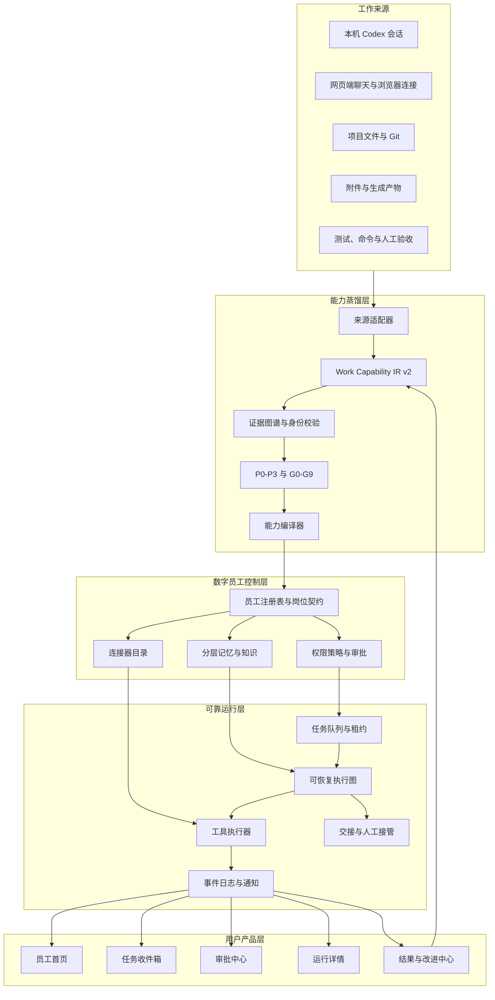

# aftercode：数字员工全量升级方案

> 文档版本：V1.0
> 适用版本：仓库 `v0.1.3` 及后续版本
> 目标产品：从“会话解析与能力包生成器”升级为“可长期工作、可授权、可审计、可持续改进的数字员工平台”

## 0. 结论先行

当前项目已经拥有一套少见的能力编译底座：它能发现本机 Codex 会话，连接网页端聊天，读取项目文件和 Git 证据，生成稳定证据编号，按 P0-P3 排序，并编译出 Skill、MCP、独立 Agent 和中文界面；独立 Agent 也已经具备读取文件、写入文件、执行命令、查看差异、验证和恢复检查点的闭环。

要成为真正的数字员工，核心升级点是把“生成一次能力包”提升为“注册一个长期岗位”。每个数字员工都需要拥有：

1. 清晰的岗位身份、服务对象和职责边界。
2. 可版本化的能力清单、输入输出契约和工具权限。
3. 可暂停、可恢复、可重试、可交接的长期任务运行时。
4. 分级授权、人工审批、密钥隔离和不可抵赖的审计记录。
5. 分层记忆，能记住事实、偏好、项目状态和历史决策，同时能解释记忆来源。
6. 任务队列、定时触发、事件触发和失败处理。
7. 以结果、质量、耗时、成本、人工介入率和回滚率为核心的考核体系。
8. 面向零代码用户的“员工首页、任务收件箱、审批中心、运行记录和改进中心”。

本方案保留现有会话蒸馏、证据图谱、能力 IR、能力包编译器和 Windows 发布底座，新增数字员工控制层、可靠运行层、治理层和运营层。

## 1. 当前项目能力盘点

### 1.1 已有能力底座

| 领域 | 当前已有能力 | 代码或产物位置 | 可直接复用程度 |
|---|---|---|---|
| 本机会话 | 标题化、按工作区归组、全文搜索、单选/多选、增量索引 | `session-forensics/lib/session-source-index.mjs`、`workspace-session-index.mjs`、`session-content-search.mjs` | 高 |
| 网页聊天 | ChatGPT 导出、Edge 当前登录页连接、批量捕获、进度、检查点、断点续读 | `chatgpt-export-store.mjs`、`chatgpt-incremental-sync.mjs`、网页伴侣模板 | 高 |
| 项目理解 | 项目发现、规则读取、依赖、入口、Git 状态、文件演化和产物链路 | `project-discovery.mjs`、`project-understanding.mjs`、`project-evidence.mjs` | 高 |
| 证据体系 | 内容寻址 evidenceId、证据账本、图谱、文件哈希和来源追踪 | `lib/evidence/`、`project-knowledge-v4.mjs` | 高 |
| 能力中间表示 | Work Capability IR v2，包含身份、来源契约、覆盖矩阵、执行图和发布判断 | `lib/ir/work-capability-ir.mjs`、`lib/ir/schemas/` | 高 |
| 优先级与质量 | P0-P3、置信度、G0-G9 发布门、原任务回放、留出任务、隔离 Agent 验证 | `lib/evaluation/`、`distillation-recommendation.mjs` | 中高 |
| 交付编译 | Skill、MCP、独立 Agent、独立 UI、README、ZIP、Windows 安装器 | `root-capability-packager.mjs`、`templates/root-capability/` | 高 |
| 本地执行 | 工作区读取、写入、补丁、命令、长进程、Git、检查点和恢复 | `templates/root-capability/agent/runtime/workspace.mjs`、`task-engine.mjs` | 中高 |
| 模型连接 | OpenAI 兼容接口、普通响应、SSE、工具调用、运行时配置 | `templates/root-capability/agent/runtime/provider.mjs`、`config.mjs` | 中高 |
| 发布与迁移 | Windows x64 一键安装、便携 ZIP、SHA-256、CI、来源证明 | `.github/workflows/`、`build-portable-workbench.mjs` | 高 |

### 1.2 从代码事实看出的能力短板

下表是数字员工化必须补齐的工程差距。这里区分“尚不存在”和“已有原型但不够生产化”，防止把已有能力重复建设。

| 优先级 | 短板 | 当前表现 | 对数字员工的影响 | 处理方式 |
|---|---|---|---|---|
| D0 | 员工身份与岗位模型缺失 | 能力包有名称和描述，但没有正式员工 ID、岗位、服务对象、责任边界、任职版本和状态 | 用户不知道这是“谁”，系统也缺少多员工管理对象 | 新增员工注册表与岗位契约 |
| D0 | 授权模型过于粗粒度 | 主要是 `allowWrite`、`allowDelete`、`allowCommand` 等开关 | 缺少按项目、文件、命令、环境和任务分别授权的机制 | 引入资源级策略、审批和策略解释 |
| D0 | 长任务运行时不够耐久 | 当前任务以本地 JSON 运行记录和有限自动步骤为核心 | 进程崩溃、电脑休眠、网络中断后的稳定续跑能力不足 | 引入持久任务状态机、租约、幂等键和事件日志 |
| D0 | 多用户与组织边界缺失 | 默认本机 `127.0.0.1`，数据以本地目录为主 | 团队服务、成员区分、员工共享和权限撤销尚未形成统一边界 | 设计本地单用户模式与团队服务模式两种部署形态 |
| D0 | 审批链不完整 | UI 能开关权限，工具执行前缺少统一审批对象 | 删除、外发、提交、发送消息等高风险动作缺少统一管控 | 新增审批收件箱和可恢复中断 |
| D1 | 记忆分层缺失 | 已有证据和会话上下文，缺少事实记忆、偏好记忆、项目记忆和任务记忆的生命周期 | 员工每次任务都重新理解，或把过期内容当成事实 | 建立带来源、时效、范围和置信度的记忆层 |
| D1 | 任务触发不足 | 以用户点击启动为主；已有若干调度器只覆盖采集业务 | 每日巡检、定时生成、事件触发和到期提醒尚未统一 | 新增触发器、队列和调度策略 |
| D1 | 连接器治理不足 | 网页伴侣和 OpenAI 兼容接口已经存在，外部系统连接缺少统一注册、授权和健康检查 | 增加平台后会形成各写一套的连接代码 | 建立 Connector SDK 和连接器目录 |
| D1 | 任务交接和人工接管不足 | 有继续、重试、停止、恢复；没有“交给谁、交接什么、为什么暂停”的标准对象 | 员工遇到不确定情况只能失败或要求用户重新描述 | 新增交接卡、阻塞原因和接管流程 |
| D1 | 结果评价偏发布门，缺少运营指标 | G0-G9 判断能否发布，运行后缺少成功率、耗时、成本、人工介入和回滚趋势 | 员工的省时效果、稳定性和成长趋势缺少量化依据 | 新增运行遥测、质量评分和员工健康度 |
| D2 | 多模态资产未统一成工作对象 | 会话事件、附件、图片和生成物能被读取，但没有统一资产生命周期、预览和权限 | 图片、文件、代码、报告之间难以形成统一任务输入输出 | 建立 Asset Registry 和媒体处理管线 |
| D2 | 能力版本与回滚不完整 | 包体有版本和发布校验，运行中的员工缺少灰度、兼容范围和回滚策略 | 新版本可能影响正在执行的任务 | 引入能力版本、运行绑定版本和发布通道 |
| D2 | 组织级知识治理不足 | 项目知识主要来自当前选择的项目和会话 | 团队复用已批准事实、模板和决策的能力不足 | 增加知识审批、来源分级、过期和撤回 |
| D2 | 对外接口偏读取，缺少事件出口 | 已有 `/api/v2` 和本地 MCP，但缺少标准 webhook、事件订阅和回调签名 | 外部系统缺少可靠接收任务完成、审批和失败通知的通道 | 增加事件总线与签名 Webhook |
| D3 | 运营界面仍以蒸馏为中心 | 主工作台解决“选会话 -> 蒸馏 -> 生成”，员工运行后的管理入口较弱 | 用户会得到包，却不知道如何持续管理员工 | 新增员工中心、任务中心和运营中心 |

### 1.3 需要立即修正的产品认知

1. 能力包是“员工的安装介质”，数字员工是“安装后长期运行的业务实体”。
2. 会话是员工经验来源之一，项目文件、实际工具运行、产物和验证结果同样是员工履历。
3. 语言模型只负责理解、规划和候选判断；身份、权限、状态、证据、计数和发布门必须由确定性代码负责。
4. “完成了一次任务”并不直接等同于“具备稳定能力”。稳定能力必须经过原任务回放、留出任务、隔离执行和运行反馈。

## 2. 数字员工产品定义

### 2.1 数字员工的标准定义

数字员工是一个有明确岗位契约的长期运行主体。它由以下六部分组成：

```text
岗位身份
  -> 能力版本
  -> 记忆与知识
  -> 工具与权限
  -> 任务与触发器
  -> 产物、证据与考核
```

一个数字员工必须能够回答以下问题：

| 用户问题 | 系统必须直接回答 |
|---|---|
| 你是谁？ | 员工名称、岗位、服务对象、当前版本、负责人 |
| 你能做什么？ | 按输入、动作、产出、验证列出的能力清单 |
| 你的职责边界是什么？ | 禁止范围、需要审批的动作、缺失条件 |
| 你正在做什么？ | 当前任务、阶段、下一步、预计等待原因 |
| 你为什么这么做？ | 触发来源、证据、规则和最近用户修正 |
| 你改了什么？ | 文件、命令、外部动作、差异和产物 |
| 结果可靠吗？ | 证据置信度、验证状态、覆盖范围和限制 |
| 出错后怎么办？ | 重试、继续、交接、恢复检查点和回滚 |
| 这次效果如何？ | 成功率、耗时、人工介入、回滚和用户评分 |

### 2.2 员工类型

第一阶段不做一个万能员工，按任务性质生成可解释的岗位类型：

| 类型 | 典型任务 | 默认工具 |
|---|---|---|
| 研究分析员 | 多会话研究、数据诊断、证据报告 | 搜索、读取、统计、网页读取、报告生成 |
| 内容生产员 | 报告、PPT、表格、图片和文案交付 | 文件、模板、脚本、渲染、视觉验收 |
| 工程维护员 | 代码修改、测试、服务启动、故障修复 | 读取、补丁、命令、Git、验证、进程 |
| 数据运营员 | 采集、清洗、覆盖检查、补采和重跑 | 浏览器连接、队列、数据处理、报告 |
| 项目协调员 | 多会话归档、任务分发、提醒、交接 | 会话、任务、通知、审批、知识 |
| 复合岗位 | 用户明确选择多种稳定能力 | 由能力依赖图自动组合，权限取并集后再经过策略裁剪 |

复合岗位必须显示能力来源和权限来源，避免用户误以为它天然拥有所有工具。

## 3. 目标架构

### 3.1 总体架构



### 3.2 部署形态

| 模式 | 适合对象 | 数据位置 | 运行方式 | 必须具备 |
|---|---|---|---|---|
| 本机个人版 | 单人、零代码、隐私优先 | 本机 AppData 和选定工作区 | Windows 一键安装，默认 `127.0.0.1` | 本地队列、审批、员工中心、备份 |
| 团队内网版 | 小团队、共享岗位和知识 | 团队数据库与对象存储 | Docker 或单机服务 | 用户身份、项目权限、审计、事件通知 |
| 托管版 | 多组织、跨电脑、远程调度 | 托管数据库、对象存储、密钥服务 | API、Worker、Web 前端分离 | 租户隔离、OAuth、计费、SLA、灾备 |

先完成本机个人版的完整闭环，再抽象团队版接口。严禁把本机文件系统直接暴露成远程服务。

## 4. 统一领域模型

### 4.1 Employee IR v1

在 Work Capability IR v2 上新增 `employee-ir/v1`，保留原始能力指纹，不复制事实。

```json
{
  "schemaVersion": "employee-ir/v1",
  "employeeId": "emp-comment-insight-01",
  "version": "1.0.0",
  "status": "active",
  "identity": {
    "displayName": "评论与视频洞察报告员工",
    "role": "研究分析员",
    "purpose": "把经过身份校验的评论和视频资料转成可审计洞察报告",
    "owner": "local-user",
    "audience": ["项目负责人", "内容运营"]
  },
  "sourceCapabilityIds": ["capability-001", "capability-004"],
  "responsibilities": [
    "检查数据身份和输入契约",
    "计算字段覆盖与指标可用性",
    "生成带证据链接的洞察报告"
  ],
  "nonResponsibilities": [
    "不替用户确认未提供的数据身份",
    "不在没有审批时发送外部消息"
  ],
  "triggers": [],
  "memoryPolicy": {},
  "toolPolicy": {},
  "workflowPolicy": {},
  "qualityPolicy": {},
  "release": {}
}
```

### 4.2 任务、运行和事件

```text
Employee
  1 -- N EmployeeVersion
  1 -- N Trigger
  1 -- N Task
Task
  1 -- N Run
Run
  1 -- N RunEvent
  1 -- N ApprovalRequest
  1 -- N Artifact
  1 -- N EvidenceRef
Run
  N -- 1 EmployeeVersion
  N -- 1 Workspace
```

必须将以下对象分开保存：

- `task`：用户想做的事情，可被暂停和重新分配。
- `run`：任务的一次执行尝试，绑定具体员工版本和输入快照。
- `event`：运行中的事实事件，追加写入，不覆盖。
- `checkpoint`：可恢复执行点，包含输入指纹、步骤状态和回滚信息。
- `approval`：等待人的决策，不用任务失败表示。
- `handoff`：从员工转交用户或另一个员工的完整交接包。
- `artifact`：生成文件、外部结果或结构化输出。
- `feedback`：用户接受、修改、否定和评分。

### 4.3 任务状态机

```text
草稿
  -> 已排队
  -> 已取证
  -> 已规划
  -> 执行中
  -> 等待审批
  -> 等待外部系统
  -> 等待用户
  -> 已暂停
  -> 失败可重试
  -> 已交接
  -> 已完成
  -> 已撤销
```

状态转换必须由确定性状态机完成，模型只能提出下一步。每次转换记录：操作者、原因、输入版本、证据引用和时间。

## 5. 针对短板的全量升级设计

### 5.1 D0：员工注册表与岗位契约

新增目录建议：

```text
session-forensics/lib/employee/
  employee-ir.mjs
  employee-registry.mjs
  employee-lifecycle.mjs
  employee-versioning.mjs
  employee-contract.mjs
```

员工生命周期：

```text
候选 -> 待验证 -> 可试运行 -> 已发布 -> 运行中 -> 已暂停 -> 已退休
```

发布条件：

- 至少一个 P1 能力通过 G0-G9；
- 员工岗位说明、输入输出、边界和审批策略完整；
- 员工版本绑定固定能力指纹；
- 至少一个原任务回放和一个留出任务通过；
- 能在隔离工作区完成一次读取、执行、验证和恢复；
- 生成包不含绝对路径、密钥和缺少重建条件的外部依赖。

### 5.2 D0：权限策略、审批和人工接管

将当前布尔开关升级为四层策略：

1. **主体层**：用户、团队、员工、连接器、外部系统。
2. **资源层**：工作区、项目、文件、命令、分支、数据集、网页账户。
3. **动作层**：读取、写入、删除、执行、提交、发送、发布、下载。
4. **条件层**：路径、命令模式、时间、金额、数据敏感级别、是否有证据和是否通过验证。

权限判断统一为：

```text
主体是否可以对资源执行动作？
  -> 资源边界检查
  -> 员工策略检查
  -> 风险等级计算
  -> 自动放行 / 请求审批 / 阻断
```

建议的默认风险等级：

| 等级 | 动作示例 | 默认行为 |
|---|---|---|
| L0 | 读取已选文件、读取证据、查看 Git 状态 | 自动放行并记录 |
| L1 | 创建临时文件、运行只读测试、生成报告 | 自动放行，显示计划 |
| L2 | 修改项目文件、启动服务、写入 Git 暂存区 | 首次任务请求审批，可对当前任务记住决定 |
| L3 | 删除、覆盖、提交、发送外部消息、访问新域名 | 每次审批，显示精确对象和差异 |
| L4 | 外部发布、支付、批量删除、跨租户访问 | 默认阻断，需双人或管理员审批 |

审批对象必须包含：动作、目标、参数摘要、风险、预计影响、证据、回滚方法、过期时间和审批人。OpenAI Agents SDK 的中断与恢复模式可作为本地审批交互参考；其核心是工具在执行前产生中断，审批后从原运行状态继续，而不是重新开始任务。[OpenAI Agents SDK 人在回路指南](https://openai.github.io/openai-agents-js/guides/human-in-the-loop/)

团队版的资源授权可采用关系型授权模型：组织 -> 项目 -> 工作区 -> 文件/数据集，同时保留“员工属于岗位、用户拥有项目”的关系。OpenFGA 的角色与资源关系建模方式适合做这一层的设计参考，但本项目个人版可以先用本地策略引擎实现相同契约。[OpenFGA 角色与权限建模](https://openfga.dev/docs/modeling/roles-and-permissions)

### 5.3 D0：耐久任务运行时

当前 `task-engine.mjs` 已有持久化运行记录、工具轨迹和恢复点，但数字员工需要进一步拆分：

```text
任务提交器 -> 队列 -> 调度器 -> Worker 租约 -> 工作流状态机 -> 工具执行器
                                                -> 事件日志
                                                -> 检查点
                                                -> 审批中断
                                                -> 交接
```

第一版不强制引入大型外部平台，先实现本地可替换接口：

```text
DurableQueue
  enqueue(task)
  lease(task, workerId, ttl)
  ack(task, result)
  retry(task, reason, backoff)
  deadLetter(task, reason)

DurableWorkflow
  start(run)
  signal(run, message)
  pause(run, reason)
  resume(run, checkpoint)
  cancel(run, reason)
  recover(run)
```

必须具备：

- 幂等键：`employeeId + taskInputHash + triggerId`；
- 工作租约：Worker 崩溃后可过期回收；
- 指数退避和最大尝试次数；
- 死信任务和人工重放；
- 外部调用超时、限流和熔断；
- 每个步骤的输入/输出哈希；
- 电脑休眠、进程重启和网络中断后的自动恢复；
- 运行版本固定，升级后的员工版本不得改写正在进行的任务。

如果后续团队版需要多年运行、跨服务和高并发，可把本地接口适配到 Temporal。Temporal 将工作流状态和事件历史持久化，使任务在崩溃、网络中断或服务重启后从事件历史继续；这正是数字员工长期运行需要的耐久执行能力。[Temporal Durable Execution](https://docs.temporal.io/temporal)

### 5.4 D1：分层记忆和知识

记忆必须带来源和生命周期，禁止把所有聊天内容直接塞进提示词。

| 记忆层 | 内容 | 保留时间 | 写入条件 |
|---|---|---:|---|
| 工作记忆 | 当前任务目标、计划、工具结果、待审批动作 | 当前运行 | 自动写入 |
| 会话记忆 | 当前会话的用户纠正、决定和上下文 | 任务组生命周期 | 由事件抽取 |
| 项目记忆 | 项目规则、目录、依赖、已验证命令和产物关系 | 项目版本周期 | 证据与验证通过后写入 |
| 用户偏好 | 语言、交付格式、默认目录、审批习惯 | 用户主动确认或长期稳定观察 | 需要确认或高置信度 |
| 组织知识 | 模板、流程、合规规则、已批准答案 | 组织治理周期 | 负责人审核 |
| 经验记忆 | 成功/失败案例、回滚原因、改进反馈 | 员工版本周期 | 通过评估后沉淀 |

每条记忆至少记录：

```json
{
  "memoryId": "mem-...",
  "scope": "project",
  "subjectId": "project-...",
  "content": "项目验证命令为 npm run test:session-forensics",
  "sourceEvidenceIds": ["evidence-..."],
  "sourceHash": "...",
  "confidence": 0.96,
  "validFrom": "...",
  "validUntil": null,
  "status": "active",
  "supersedes": null,
  "approvedBy": null
}
```

检索顺序：当前任务 -> 当前项目 -> 员工岗位 -> 用户偏好 -> 组织知识。每次注入都显示来源、更新时间和冲突状态。过期或被新纠正取代的记忆只降级，不覆盖原始证据。

### 5.5 D1：触发器、队列和主动工作

触发器分为：

| 类型 | 示例 | 第一版实现 |
|---|---|---|
| 手动触发 | 用户点击“开始任务” | 已有能力，迁移到任务中心 |
| 时间触发 | 每天 9:00 生成数据日报 | 本地计划任务或内置调度器 |
| 文件触发 | 新 CSV 到达后自动检查覆盖率 | 文件夹观察器 + 去抖 |
| Git 触发 | 新提交后运行验证并生成变更摘要 | 本地 Git 轮询或 webhook |
| 会话触发 | 新网页聊天同步完成后进入蒸馏队列 | 同步任务完成事件 |
| 外部事件 | 收到表单、邮件、Webhook 后创建任务 | 签名 Webhook 入口 |
| 失败触发 | 任务进入死信或验证失败 | 恢复员工或人工收件箱 |

触发器必须有启停、试运行、最近一次运行、下次运行、失败次数和去重规则。没有触发条件时，员工只保持待命状态，不主动猜测任务。

### 5.6 D1：连接器平台

新增统一连接器契约：

```text
Connector
  manifest()                  // 名称、版本、权限、数据类型
  healthCheck()               // 登录、配额、网络和版本
  discover()                  // 发现可用资源
  pull(cursor)                // 增量读取
  push(payload)               // 可选写入
  subscribe()                 // 可选事件订阅
  revoke()                    // 清理连接状态
```

初始连接器：

- 本机 Codex 会话；
- ChatGPT 官方导出；
- ChatGPT Edge 网页伴侣；
- DeepSeek、Gemini、豆包网页伴侣；
- 本地文件夹和 Git；
- OpenAI 兼容模型；
- 本地报告、表格、PPT 和图片产物。

连接器状态必须区分：未连接、已连接、需要重新授权、读取中、部分成功、已失效。浏览器登录态只留在用户浏览器和本地连接通道，禁止进入员工包和远程日志。

团队或远程 MCP 连接需要按照 MCP 的 HTTP 授权规范设计：使用 OAuth 资源指示器、短期访问令牌、受众校验、PKCE 和明确的 401/403 错误，不把令牌放进 URL，也不把上游令牌原样转发。[MCP Authorization](https://modelcontextprotocol.io/specification/2025-06-18/basic/authorization)

### 5.7 D1：运行遥测和员工考核

每次运行记录以下指标：

| 指标 | 计算方式 | 用途 |
|---|---|---|
| 任务成功率 | 完成且验收通过的运行 / 总运行 | 判断基础可靠性 |
| 首次通过率 | 无人工修改、无重试即通过的运行 / 总运行 | 判断能力成熟度 |
| 人工介入率 | 需要审批、接管或补充输入的运行 / 总运行 | 判断自动化程度 |
| 平均完成时长 | 从排队到完成的时长 | 判断效率 |
| 工具失败率 | 失败工具调用 / 工具调用总数 | 定位连接器和权限问题 |
| 回滚率 | 执行回滚的运行 / 有修改的运行 | 判断修改风险 |
| 产物验收率 | 被用户接受或验证通过的产物 / 产物总数 | 判断交付质量 |
| 证据完整率 | 可追溯到 evidenceId 的声明 / 声明总数 | 判断可审计性 |
| 单任务模型成本 | 输入输出 token、调用次数或本地资源时长 | 控制预算 |
| 节省时间 | 人工基线时长 - 员工运行时长 - 介入时长 | 判断业务价值 |

GenAI 运行遥测字段应采用稳定的语义命名，至少记录员工、版本、模型、操作、输入输出数量、错误和耗时。OpenTelemetry 的语义约定强调统一操作名、目标和结果属性，适合用作遥测字段设计基线。[OpenTelemetry Semantic Conventions](https://opentelemetry.io/docs/specs/semconv/)

### 5.8 D2：多模态资产注册表

把会话中的图片、文件、代码片段、网页快照、音频、视频和生成物统一登记为 `Asset`：

```text
Asset
  assetId
  kind: text | image | audio | video | document | code | archive
  sourceConnector
  sourceLocator
  sha256
  mediaType
  size
  extractedText
  previewRef
  permissions
  evidenceRefs
  createdAt
  retentionPolicy
```

处理顺序：原始保存 -> 哈希 -> 类型检测 -> 安全扫描 -> 可选 OCR/转写/视觉理解 -> 建立与会话、文件、任务和产物的关系。模型生成的图像、`image2` 调用、附件和远程 URL 必须保存调用事件与资产关系，单独保留文字摘要并不足以完成追溯。

### 5.9 D2：能力版本、灰度和回滚

员工版本与能力包版本分离：

- 能力版本：单项能力契约和执行图变更。
- 员工版本：能力组合、权限、记忆策略和 UI 变更。
- 安装包版本：程序运行时和模板变更。

发布通道：候选 -> 内测 -> 灰度 -> 稳定 -> 退休。

每个运行绑定：`employeeId`、`employeeVersion`、`capabilityFingerprint`、`runtimeVersion`。升级时保留旧版本运行，出现质量下降可以只回滚员工版本，不回滚整个工作台。

## 6. 用户界面全量升级

### 6.1 主工作台导航

左侧固定导航，右侧一次只显示一个主页面：

1. **员工首页**：我有哪些员工、今天做了什么、哪些任务需要我。
2. **创建员工**：选择会话、项目和产物，运行智能蒸馏。
3. **任务收件箱**：待处理、执行中、等待我、已完成、失败可重试。
4. **审批中心**：按风险等级展示精确动作、影响和回滚。
5. **员工详情**：岗位说明、能力、边界、连接器、记忆和版本。
6. **运行记录**：步骤、工具、文件差异、命令、证据、产物和验证。
7. **结果与改进**：接受、修改、退回、评分、纠正和重新编译。
8. **连接与设置**：浏览器、模型、文件夹、Git、密钥和权限。

蒸馏页与运行页分开；网页聊天连接只出现在连接页面和创建员工流程中，不挤进独立员工的任务界面。

### 6.2 员工首页必须展示

- 员工名称和直白岗位说明；
- 当前版本、状态和负责人；
- 能做的三到五件具体事情；
- 职责边界和禁止事项；
- 今日任务数、成功率、待审批数和最近产物；
- “交给它一个任务”主按钮；
- “查看证据”“暂停员工”“回滚版本”次按钮。

### 6.3 零代码任务体验

用户只填写：

```text
我想完成什么？
需要处理哪些资料？（可选，直接选择文件或文件夹）
结果希望放在哪里？（可选，选择目录）
```

系统自动展示：

- 将读取的资料；
- 将使用的员工能力；
- 将执行的文件和命令；
- 需要人工决定的动作；
- 预计产物和验证方式。

用户看到“开始执行”前，必须能展开查看范围。路径使用选择器和最近使用列表，不要求输入绝对路径。

### 6.4 运行详情页

运行详情使用时间线：

```text
已接收任务
  -> 读取项目规则
  -> 匹配 P1 能力
  -> 等待用户审批写入
  -> 执行文件修改
  -> 运行验证
  -> 生成产物
  -> 完成并提交证据
```

每一步都提供“发生了什么、为什么、用了什么、产生了什么、是否可回滚”。技术细节放在证据抽屉，主视图保持业务语言。

## 7. API 与事件契约

### 7.1 员工 API

```text
GET    /api/v3/employees
POST   /api/v3/employees/from-distillation
GET    /api/v3/employees/:employeeId
PATCH  /api/v3/employees/:employeeId
POST   /api/v3/employees/:employeeId/publish
POST   /api/v3/employees/:employeeId/pause
POST   /api/v3/employees/:employeeId/retire
GET    /api/v3/employees/:employeeId/versions
POST   /api/v3/employees/:employeeId/rollback
```

### 7.2 任务与运行 API

```text
GET    /api/v3/tasks
POST   /api/v3/tasks
GET    /api/v3/tasks/:taskId
POST   /api/v3/tasks/:taskId/pause
POST   /api/v3/tasks/:taskId/resume
POST   /api/v3/tasks/:taskId/cancel
POST   /api/v3/tasks/:taskId/retry
POST   /api/v3/tasks/:taskId/handoff
GET    /api/v3/runs/:runId
GET    /api/v3/runs/:runId/events
GET    /api/v3/runs/:runId/evidence
GET    /api/v3/runs/:runId/artifacts
```

### 7.3 审批、记忆与运营 API

```text
GET    /api/v3/approvals
POST   /api/v3/approvals/:approvalId/approve
POST   /api/v3/approvals/:approvalId/reject
GET    /api/v3/memories
POST   /api/v3/memories/:memoryId/confirm
POST   /api/v3/memories/:memoryId/revoke
GET    /api/v3/metrics/employees/:employeeId
GET    /api/v3/health
GET    /api/v3/connectors
POST   /api/v3/connectors/:connectorId/health-check
POST   /api/v3/webhooks/:connectorId/events
```

所有写操作支持 `Idempotency-Key`；所有事件携带 `eventId`、`runId`、`employeeVersion`、`occurredAt`、`actor`、`source` 和 `evidenceRefs`。

事件格式采用 CloudEvents 思路，统一事件属性和传递方式，便于以后接入队列、事件路由和外部系统。[CloudEvents](https://cloudevents.io/)

## 8. 数据存储与迁移

### 8.1 本机个人版

建议目录：

```text
%LOCALAPPDATA%\aftercode\
  config\
  employees\
  tasks\
  runs\
  events\
  approvals\
  memories\
  connectors\
  assets\
  indexes\
  backups\
```

现有 `output/session-forensics/runs` 和能力包目录保留为兼容读取源，新增迁移器把旧记录导入新对象。原始 JSONL、网页捕获和产物不覆盖，数据库只做查询投影。

### 8.2 团队版

建议组合：

- PostgreSQL：员工、任务、运行、审批、记忆元数据和关系；
- 对象存储：原始会话、附件、产物和大日志；
- Redis 或兼容队列：短任务、租约和限流；
- 事件总线：任务完成、审批、失败和连接器事件；
- 密钥服务：API Key、OAuth refresh token 和浏览器配对密钥；
- 可观测性后端：指标、日志和 Trace。

本机版先使用文件型实现，接口必须与团队版相同，避免日后重写业务层。

## 9. 实施路线图

### 阶段 A：员工对象最小闭环（2 周）

目标：从能力包注册一个可查看、可暂停、可版本化的数字员工。

- 新增 Employee IR、注册表、生命周期和版本绑定。
- 能力包生成后自动创建员工草稿。
- 员工首页显示岗位、能力、边界、版本和当前状态。
- 任务运行绑定员工版本。
- 增加员工对象测试和旧包兼容迁移测试。

完成标志：用户可以从一个现有能力包创建员工、查看其能力、暂停员工并恢复旧版本。

### 阶段 B：安全执行和审批闭环（2-3 周）

- 将权限布尔值映射到动作级策略。
- 新增风险分级、审批请求、批准/驳回和过期。
- 删除、Git 写入、外发和新网络域名必须进入审批。
- 审批中断后从原状态继续，禁止重新生成计划。
- 审批日志加入审计清单和哈希链。

完成标志：一个包含文件修改和命令的任务可以自动读取，修改前暂停等待用户批准，批准后继续并完成验证；驳回后给出可解释结果。

### 阶段 C：耐久任务和任务收件箱（3-4 周）

- 抽象队列、租约、重试、死信和幂等键。
- 任务运行从单次 HTTP 请求中剥离。
- 支持进程重启、电脑休眠、网络断开后的续跑。
- 新增任务收件箱、失败重试和人工交接。
- 迁移网页会话同步与能力执行使用统一任务对象。

完成标志：关闭工作台后重新打开，未完成任务能从最近检查点继续，重复点击不会创建重复外部动作。

### 阶段 D：记忆、连接器和主动触发（4-6 周）

- 新增记忆层、来源、置信度、过期和撤回。
- 连接器统一健康检查、增量游标、授权和事件订阅。
- 实现时间、文件、会话完成和 Webhook 触发。
- 添加外部动作的幂等和回调签名。

完成标志：新会话同步完成后可以自动触发员工生成报告；员工能引用项目记忆，并在用户撤回后停止使用过期记忆。

### 阶段 E：运营中心与持续改进（3-4 周）

- 运行指标、员工健康度、成本和节省时间。
- 结果接受、修改、退回和评分。
- 反馈自动进入候选修正，不直接覆盖已发布能力。
- 员工版本灰度、比较和回滚。
- 生成周报：高频任务、失败原因、人工介入、可蒸馏候选。

完成标志：负责人能看到一个员工过去 30 天的成功率、人工介入率、回滚率和改进建议。

### 阶段 F：团队服务化（后续）

- 用户、组织、项目和员工关系模型。
- OAuth 登录、MCP HTTP 授权和资源受众校验。
- 数据库、对象存储、队列和事件总线适配。
- Windows 本机 Worker 作为团队服务的受控执行节点。
- 组织级审计、保留策略、导出和删除请求。

完成标志：不同用户可以共享同一员工岗位，同时只能访问自己有权限的项目、文件和运行记录。

## 10. 发布门从 G0-G9 扩展为 E0-E8

保留现有 G0-G9 作为能力质量门，再增加数字员工发布门：

| 门禁 | 检查内容 | 阻断条件 |
|---|---|---|
| E0 | 员工身份、岗位说明、负责人和版本 | 缺少岗位或边界 |
| E1 | 能力指纹和运行绑定 | 运行未固定版本 |
| E2 | 工具权限与风险等级 | 存在无策略工具 |
| E3 | 审批与中断恢复 | 高风险动作缺少暂停恢复机制 |
| E4 | 记忆来源和撤回 | 关键记忆无来源或缺少撤回机制 |
| E5 | 队列、幂等、重试和死信 | 重复执行或崩溃丢进度 |
| E6 | 运行遥测 | 缺少成功、失败和介入统计 |
| E7 | 交接、回滚和人工接管 | 失败只能重新描述任务 |
| E8 | 安装、升级、卸载和数据迁移 | 新电脑恢复或安全回滚链路缺失 |

员工状态判定：

```text
blocked      G 门或 E 门存在 fail
candidate    仍有门禁 pending，只能试运行
restricted   通过基础门禁，但部分能力、数据或权限受限
publishable  G0-G9 与 E0-E8 全部通过
```

## 11. 全量验收矩阵

### 11.1 个人版验收

| 场景 | 必须观察到的结果 |
|---|---|
| 从现有能力包创建员工 | 生成员工 ID、岗位说明、能力版本和中文首页 |
| 只读任务 | 自动读取证据和项目，输出结果，不触发写入审批 |
| 文件修改任务 | 修改前出现明确审批卡，驳回后保持文件原样 |
| 命令任务 | 命令、工作目录、超时和输出在执行前可见 |
| 任务中断 | 关闭工作台后能从检查点继续 |
| 重复提交 | 相同幂等键不重复执行外部动作 |
| 工具失败 | 进入可重试或死信状态，保留失败原因 |
| 用户接管 | 交接包包含已完成步骤、待办、文件差异和证据 |
| 版本升级 | 新任务用新版本，旧任务继续用旧版本 |
| 版本回滚 | 员工回到旧版本，历史运行仍可查看 |
| 记忆撤回 | 后续任务不再检索已撤回记忆，原证据保留 |
| 换机安装 | 一键安装后可导入员工包，敏感凭证需重新连接 |

### 11.2 团队版验收

- 用户 A 仅能读取自己获得授权的项目、会话和资产。
- 员工只能访问绑定的项目和连接器。
- MCP 访问令牌仅适用于令牌所绑定的员工和服务。
- 审批记录包含真实操作者，员工严禁自行批准自己的高风险动作。
- 任务、事件和产物可按组织、项目和员工筛选。
- 删除用户或项目后，原始证据、审计记录和保留策略符合配置。

### 11.3 业务价值验收

至少选择三类真实岗位进行 30 天试运行：

1. 工程维护员：代码修复、测试和回滚。
2. 数据运营员：网页会话同步、字段覆盖和报告重跑。
3. 内容生产员：报告或演示文稿生成、渲染和验收。

每类岗位至少收集：20 个任务、5 个留出任务、3 个失败恢复、3 个用户纠正和 1 次版本回滚。发布报告必须展示人工基线、员工耗时、成功率、介入率、产物接受率和证据完整率。

## 12. 代码落地清单

建议按以下顺序新增文件，旧模块逐步接入，不进行一次性大重写：

```text
session-forensics/lib/employee/
  employee-ir.mjs
  employee-registry.mjs
  employee-contract.mjs
  employee-lifecycle.mjs
  employee-versioning.mjs

session-forensics/lib/runtime/
  durable-queue.mjs
  task-state-machine.mjs
  worker-lease.mjs
  retry-policy.mjs
  idempotency-store.mjs
  dead-letter-store.mjs
  handoff-store.mjs

session-forensics/lib/policy/
  action-catalog.mjs
  risk-policy.mjs
  authorization-engine.mjs
  approval-store.mjs
  audit-chain.mjs

session-forensics/lib/memory/
  memory-ir.mjs
  memory-store.mjs
  memory-retriever.mjs
  memory-lifecycle.mjs

session-forensics/lib/connectors/
  connector-contract.mjs
  connector-registry.mjs
  connector-health.mjs
  webhook-signature.mjs

session-forensics/lib/observability/
  run-telemetry.mjs
  employee-metrics.mjs
  event-envelope.mjs

session-forensics/employee-runtime.test.mjs
session-forensics/employee-policy.test.mjs
session-forensics/durable-task-runtime.test.mjs
session-forensics/memory-lifecycle.test.mjs
session-forensics/connector-contract.test.mjs
```

前端建议从 `src/main.jsx` 中拆出：

```text
src/employee/
  EmployeeHome.jsx
  EmployeeCreate.jsx
  EmployeeInbox.jsx
  ApprovalCenter.jsx
  EmployeeRun.jsx
  EmployeeReview.jsx
  EmployeeSettings.jsx
```

`src/main.jsx` 当前体量已经很大，数字员工化阶段应优先做路由和页面边界拆分，避免继续向单文件追加功能。

## 13. 不纳入本轮的内容

为控制风险，以下内容不作为第一阶段硬目标：

- 让员工无审批地访问所有本地文件、所有浏览器登录态或所有网络地址。
- 让一个万能员工自动合并所有项目和所有会话。
- 用模型输出直接决定身份、权限、金额、删除范围或发布结果。
- 把原始会话、浏览器 Cookie、模型密钥或 OAuth refresh token 写进能力包。
- 在没有留出任务和运行反馈时宣称员工已经达到生产级。
- 先做云端多租户，再补本机权限和证据链。

## 14. 最终产品形态

用户看到的产品路径应是：

```text
选择真实工作
  -> 系统理解目标、纠正、文件、工具和产物
  -> 推荐一个有岗位名称的数字员工
  -> 查看它能做什么、职责边界是什么、为什么可信
  -> 一键试运行
  -> 需要时审批或接管
  -> 看到结果、证据、差异和验证
  -> 接受结果或提交纠正
  -> 系统生成下一版员工能力
```

数字员工的成功标准是：用户把一个明确任务交给它后，能够看懂它的职责和边界，能够控制它的高风险动作，能够在中断后继续，能够追溯每个结论和变更，并且能从真实反馈中持续改善。达到这一标准，项目才完成从“蒸馏工具”到“数字员工平台”的产品跃迁。

## 15. 本方案的第一批可执行任务

按依赖顺序，第一批任务固定为：

1. 建立 `employee-ir/v1` 和员工注册表，导入一个现有能力包作为员工候选。
2. 把现有 Agent 工具映射到动作目录和风险等级。
3. 增加审批请求、批准、驳回、过期和运行恢复接口。
4. 将 `task-engine.mjs` 的运行记录抽象为任务状态机、事件日志和幂等键。
5. 为员工首页、任务收件箱和审批中心建立独立页面。
6. 增加员工运行指标和最小反馈入口。
7. 为以上七项建立测试、迁移脚本和 Windows 便携包回归。

这七项完成后，项目就拥有数字员工的最小闭环；之后再接入记忆、主动触发、团队授权和远程部署，能够持续演进而无需推翻当前蒸馏器底座。
